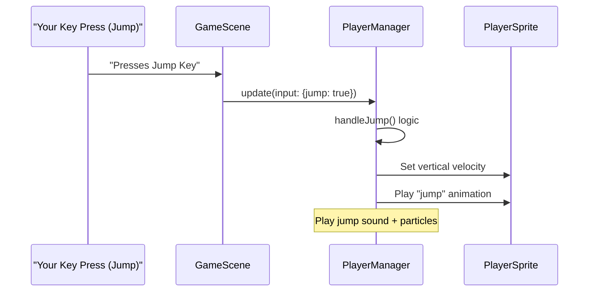
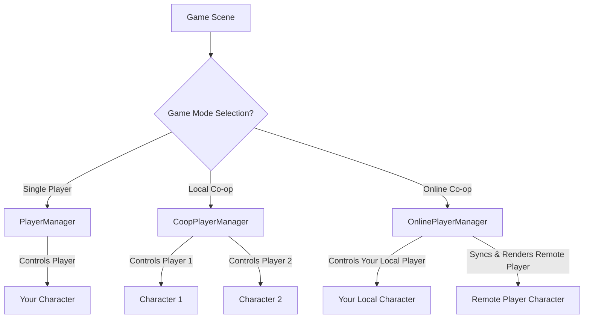

# Chapter 1: Player & Combat System

Welcome to the world of `JumpJumpJump`! In this first chapter, we're going to dive into the very core of what makes a platformer game fun and interactive: controlling your character. Imagine trying to play a game where your hero just stands there, unable to move, jump, or fight. Not much fun, right?

## What is the Player & Combat System?

At its heart, the **Player & Combat System** is like the brain and body of your character in `JumpJumpJump`. It defines *everything* about your player: how they move, how they interact with the world, and how they fight enemies. Think of it as your character's core identity and abilities.

### Why Do We Need It? (The Problem)

The main problem this system solves is: **How do we make our player character feel alive and responsive?** We want to move smoothly, jump precisely, shoot bad guys, and generally be an awesome hero in the game world.

### Your First Adventure: A Simple Use Case

Let's imagine a common scenario in `JumpJumpJump`:
1.  You **run** right towards a tricky jump.
2.  You **jump** to clear a big gap.
3.  Mid-air, you realize you need a bit more height, so you **double-jump**.
4.  You land on an enemy and **stomp** it, bouncing off to safety.
5.  Another enemy appears, so you **aim your weapon** and **shoot** it!

The Player & Combat System handles every single one of these actions, making sure they feel just right and respond perfectly to your commands.

## Key Concepts of Your Hero

Let's break down the main ideas behind this system:

1.  **Player Identity:** This includes your character's `health` (how much damage they can take), `lives` (how many chances you have), `score`, and `coins` collected.
2.  **Movement:**
    *   **Walking & Running:** Smooth left/right movement.
    *   **Jumping:** Not just basic jumps, but also:
        *   **Double-Jump:** An extra jump in mid-air for reaching higher places.
        *   **Variable Jump Height:** How long you press the jump button affects how high you go.
        *   **Coyote Time:** A clever trick that gives you a tiny grace period to jump even after walking off a platform. No more frustrating missed jumps!
        *   **Jump Buffering:** The game remembers your jump press for a moment *before* you land, so you can perfectly time your next jump without mashing the button.
3.  **Combat:**
    *   **Stomp Attack:** A classic platformer move! Jump on enemies to defeat them and bounce higher.
    *   **Shooting:** Firing projectiles in any direction you aim.
    *   **Aiming:** Your weapon follows your mouse or gamepad, making combat feel dynamic.
    *   **Reloading:** Weapons have a cooldown, preventing you from spamming shots, and sometimes even a visual bar to show progress.
4.  **Visual Feedback:** The system includes visual cues like `health bars`, `reload bars`, `damage flashes` (your character turning red briefly when hit), and `particles` (like dust when you run or trails when you jump).

## The Managers: Who's in Charge?

The "Player & Combat System" isn't just one big piece of code; it's managed by specialized components depending on how you're playing:

*   **`PlayerManager`:** This is the manager for **single-player** mode. It controls your one character's movement, jumps, shooting, health, and more.
*   **`CoopPlayerManager`:** When you play with a friend on the **same computer** (local co-op), this manager handles both players. It ensures each player has independent controls, health, and interactions.
*   **`OnlinePlayerManager`:** For **internet co-op**, this manager is even more complex! It still manages each player's actions, but crucially, it synchronizes everything over the network so that you and your friend's games stay perfectly in sync, even across the internet.

## How to Get Your Player Moving and Fighting (A Hands-On Look)

Let's focus on the `PlayerManager` (for single-player) to see how you tell your character what to do. Think of the `PlayerManager` as the central control panel for your character.

### Step 1: Create Your Player

Before your character can do anything, it needs to exist! This usually happens when a new game level starts. You tell the `PlayerManager` where to place your hero.

```typescript
// Inside your GameScene (where your game level is managed)
// 'this' refers to your current game scene, 'audioManager' helps play sounds.
import { PlayerManager } from '../managers/PlayerManager'
import { AudioManager } from '../utils/AudioManager' // Used by PlayerManager for sounds

// ... later, in your scene's 'create' method ...
const audioManager = new AudioManager(this) // Initialize sound system
// Create the PlayerManager, giving it access to the scene and audio
const playerManager = new PlayerManager(this, audioManager)

// Now, tell the playerManager to set up the player character.
// 'this.platforms' is a group of physical platforms the player can collide with.
playerManager.create(this.platforms)
```
*What happens:* This code brings your player character to life at a specific starting position (`spawnX`, `spawnY`). It sets up its visual appearance (like the alien skin), its animations (idle, walk, jump), and most importantly, its **physics body**, so it can interact with the game world, fall due to gravity, and land on `platforms`.

### Step 2: Update Player Actions Continuously

In a game, things are constantly changing! So, in every tiny fraction of a second (this is called the `update` loop), you need to check what the player is doing (like pressing keys or moving the mouse) and tell the `playerManager` to react.

```typescript
// Inside your GameScene's 'update' method (this runs many times per second!)
import { PlayerInput } from '../types/GameTypes' // This defines what player input looks like

// ... inside update(time, delta) ...
// Gather all the player's input from keyboard and mouse
const input: PlayerInput = {
  moveLeft: this.cursors.left.isDown || this.keys.a.isDown, // 'A' key or Left arrow
  moveRight: this.cursors.right.isDown || this.keys.d.isDown, // 'D' key or Right arrow
  jump: this.cursors.up.isDown || this.keys.space.isDown, // Spacebar or Up arrow
  shoot: this.input.activePointer.isDown, // Left mouse click
  aimX: this.input.activePointer.x + this.cameras.main.scrollX, // Mouse X position
  aimY: this.input.activePointer.y + this.cameras.main.scrollY // Mouse Y position
}

// Pass this input to the PlayerManager to make the character act!
playerManager.update(input)
```
*What happens:* Every time `update()` runs, the game checks which keys are pressed and where your mouse is. It then bundles all this information into an `input` object and sends it to the `playerManager`. The `playerManager` then processes this input to make your character move, jump, shoot, and aim.

## Inside the Player & Combat System (How It Works)

The `PlayerManager` is a complex piece of code, but we can understand its core logic! It's found in `frontend/src/managers/PlayerManager.ts` and uses definitions from `frontend/src/types/GameTypes.ts`.

### The Journey of a Jump (Non-Code Walkthrough)

Let's follow what happens when you press the "Jump" button:

1.  **Input Detected:** The game scene (which you'll learn about in the next chapter: [Phaser Scene System](02_phaser_scene_system_.md)) detects that you've pressed the jump key.
2.  **Input Sent:** This information is packaged into a `PlayerInput` object (where `jump` is `true`) and sent to the `PlayerManager`'s `update()` method.
3.  **Jump Logic:** The `PlayerManager`'s `handleJump()` function kicks in. It first checks if your character is currently standing on a platform (`onGround`).
    *   If `onGround` is true, it makes your character leap upwards, plays a jump sound, and makes sure you can use your "double-jump" later if you need it.
    *   If you're already in the air, but haven't `double-jumped` yet, it gives you a second boost upwards, plays a special double-jump sound, and then marks the double-jump as used.
4.  **Visual Feedback:** As you jump, the player's visual sprite changes to a "jump" animation, and some cool "jump particles" might appear under your feet.

Here's a simple diagram to illustrate this flow:



### Simplified Code Snippets

Let's peek at some simplified parts of the `PlayerManager.ts` file to see how these actions are coded.

**1. Creating the Player (Excerpt from `createPlayer()`):**
This code sets up the visual sprite for your character and defines its physical properties.

```typescript
// Inside PlayerManager.ts (simplified)
private createPlayer(): void {
  // Create player sprite using a character skin (e.g., 'alienBeige_stand')
  this.player = this.scene.physics.add.sprite(
    this.config.spawnX, this.config.spawnY, `${this.config.equippedSkin}_stand`
  )
  this.player.setDepth(5) // Ensure player is drawn on top of most things
  this.player.play('player_idle') // Start with the idle animation

  // Get and configure the player's physics body for movement and collisions
  const body = this.player.body as Phaser.Physics.Arcade.Body
  body.setSize(this.player.width * 0.6, this.player.height * 0.9) // Adjust collision box size
  body.setOffset(this.player.width * 0.2, this.player.height * 0.1) // Adjust collision box position
  body.setMaxVelocity(400, 800) // Limit player's maximum horizontal and vertical speed
}
```
*Explanation:* This code creates a `Phaser.Physics.Arcade.Sprite` object, which is the visual representation of your player that also interacts with the game's physics system. It sets its starting image, its layer (`depth`), and starts the `player_idle` animation. It also fine-tunes the collision box and limits how fast your player can move.

**2. Handling Left/Right Movement (Excerpt from `handleMovement()`):**
This function checks if you're pressing left or right and adjusts your character's speed and animation.

```typescript
// Inside PlayerManager.ts (simplified handleMovement())
private handleMovement(input: PlayerInput): void {
  const body = this.player.body as Phaser.Physics.Arcade.Body
  const onGround = body.touching.down // Check if the player is currently on a platform

  if (input.moveLeft) {
    body.setVelocityX(-this.config.speed) // Move left by setting negative horizontal speed
    this.player.setFlipX(true) // Flip the sprite horizontally to face left
    if (onGround) this.player.play('player_walk', true) // Play walk animation if on ground
  } else if (input.moveRight) {
    body.setVelocityX(this.config.speed) // Move right by setting positive horizontal speed
    this.player.setFlipX(false) // Don't flip the sprite (face right)
    if (onGround) this.player.play('player_walk', true) // Play walk animation if on ground
  } else {
    body.setVelocityX(0) // Stop horizontal movement if no left/right input
    if (onGround) this.player.play('player_idle', true) // Play idle animation if on ground
  }
}
```
*Explanation:* This code directly controls your player's horizontal movement. If you press left, the `setVelocityX` makes the player move left, and `setFlipX(true)` flips the character's image. The opposite happens for right. If no direction is pressed, `setVelocityX(0)` makes the character stop immediately for a responsive feel, and the `player_idle` animation plays.

**3. Handling Jumps and Double-Jumps (Excerpt from `handleJump()`):**
This function enables both your initial jump and the powerful double-jump.

```typescript
// Inside PlayerManager.ts (simplified handleJump())
private handleJump(input: PlayerInput): void {
  const body = this.player.body as Phaser.Physics.Arcade.Body
  const onGround = body.touching.down // Check if player is touching the ground

  // Reset double jump ability when player lands on a platform
  if (onGround) {
    this.state.canDoubleJump = true
    this.state.hasDoubleJumped = false
  }

  if (input.jump) { // If the jump button is currently pressed
    if (onGround) {
      // Perform the first jump (set negative vertical velocity to go up)
      body.setVelocityY(this.config.jumpVelocity)
      this.player.play('player_jump', true)
      this.audioManager.playJumpSound()
      this.state.canDoubleJump = true // Player can still double jump after this
    } else if (this.state.canDoubleJump && !this.state.hasDoubleJumped) {
      // Perform the double jump if not on ground and double jump is available
      body.setVelocityY(this.config.jumpVelocity)
      this.player.play('player_jump', true)
      this.audioManager.playJumpSound(true) // Play a distinct double-jump sound
      this.state.hasDoubleJumped = true // Mark double jump as used
      // Additional visual effects like spinning are omitted for simplicity
    }
  }
}
```
*Explanation:* This code is crucial for jumping. When `onGround` is true and you press `jump`, your character is given a strong upward velocity (`jumpVelocity` is usually a negative number for upward movement in Phaser). If you're in the air and haven't used your `canDoubleJump` yet, pressing `jump` again will give you another boost!

**4. Handling Shooting (Excerpt from `handleShooting()` and `fireBullet()`):**
This manages when and how your character fires their weapon.

```typescript
// Inside PlayerManager.ts (simplified handleShooting())
private handleShooting(input: PlayerInput): void {
  if (!input.shoot) return // If shoot button is not pressed, do nothing

  const weaponConfig = WEAPON_CONFIGS[this.config.equippedWeapon as WeaponType]
  const currentTime = this.scene.time.now

  // Check if enough time has passed since the last shot (respecting cooldown)
  if (currentTime - this.lastShotTime < weaponConfig.cooldown) return

  this.lastShotTime = currentTime // Update the time of this shot
  this.fireBullet(weaponConfig) // Call the helper to actually create and launch a bullet
}

// Inside PlayerManager.ts (simplified fireBullet())
private fireBullet(weaponConfig: typeof WEAPON_CONFIGS[WeaponType]): void {
  // Get a bullet from a 'pool' of bullets (reusing objects is good for performance!)
  const bullet = this.bullets.get(this.gun.x, this.gun.y, weaponConfig.projectileKey)
  if (!bullet) return // If no bullet is available (e.g., pool is empty), do nothing

  bullet.setActive(true).setVisible(true).setDepth(4) // Make the bullet appear

  const angle = this.gun.rotation // Get the direction the gun is currently pointing
  const velocity = weaponConfig.projectileSpeed

  // Set the bullet's velocity based on the aim angle and its speed
  bullet.setVelocity(
    Math.cos(angle) * velocity,
    Math.sin(angle) * velocity
  )
  bullet.setRotation(angle) // Make the bullet visually rotate to match its trajectory
  bullet.setData('damage', weaponConfig.damage) // Store how much damage this bullet does

  // Make sure gravity doesn't pull the bullet down
  const body = bullet.body as Phaser.Physics.Arcade.Body
  body.setAllowGravity(false)

  // Automatically destroy the bullet after 2 seconds to clean up the game world
  this.scene.time.delayedCall(2000, () => bullet.destroy())
  this.audioManager.playShootSound() // Play the shooting sound
}
```
*Explanation:* The `handleShooting` function first checks if you're pressing the shoot button and if the weapon's cooldown period has passed. If both are true, it calls `fireBullet`. `fireBullet` gets a bullet sprite (from a `bullets` group, which efficiently reuses sprites), positions it at the gun's location, sets its speed and direction based on `this.gun.rotation`, and then makes it visible. It also plays a sound and sets up a timer to remove the bullet after a short flight.

**5. Weapon Aiming (Excerpt from `handleGunAiming()`):**
This function makes your character's weapon follow your aiming input (mouse or gamepad).

```typescript
// Inside PlayerManager.ts (simplified handleGunAiming())
private handleGunAiming(input: PlayerInput): void {
  // Determine the target (aim) point, using mouse coordinates or a default direction
  const aimX = input.aimX ?? this.player.x + (this.player.flipX ? -100 : 100)
  const aimY = input.aimY ?? this.player.y

  // Calculate the angle from the player's position to the aim point
  const angleToAim = Phaser.Math.Angle.Between(
    this.player.x, this.player.y, aimX, aimY
  )

  // Position the gun a short distance in front of the player
  const distanceFromPlayer = 30
  const gunX = this.player.x + Math.cos(angleToAim) * distanceFromPlayer
  const gunY = this.player.y + Math.sin(angleToAim) * distanceFromPlayer
  this.gun.setPosition(gunX, gunY)

  // Flip the gun sprite vertically if aiming to the left, so it looks correct
  if (angleToAim > Math.PI / 2 || angleToAim < -Math.PI / 2) {
    this.gun.setScale(1.0, -1.0) // Flips sprite around Y-axis
  } else {
    this.gun.setScale(1.0, 1.0)
  }
  this.gun.setRotation(angleToAim) // Rotate the gun to match the aim angle
}
```
*Explanation:* This code constantly calculates the mathematical angle from your player's center to your mouse cursor (or gamepad's aim direction). It then updates the `gun` sprite's position to be slightly in front of your player along that angle, and rotates the gun to point exactly in that direction. The `setScale` part is a neat trick to flip the gun sprite visually when you aim left, so it doesn't look upside down.

## Comparing the Player Managers

As mentioned, `JumpJumpJump` supports single-player, local co-op, and online co-op. The "Player Manager" chosen adapts to these modes:

| Feature / Manager | `PlayerManager` (Single Player) | `CoopPlayerManager` (Local Co-op) | `OnlinePlayerManager` (Internet Co-op) |
| :---------------- | :------------------------------ | :-------------------------------- | :------------------------------------- |
| **Players**       | Manages 1 local player          | Manages 2 local players           | Manages 1 local, 1 remote player       |
| **Input Sources** | Keyboard or 1 Gamepad           | 2 Gamepads (or Keyboard for P1)   | Local Keyboard/Gamepad, remote via network |
| **Health & Lives**| One set for the player          | Independent for each player       | Independent & synchronized for each player |
| **UI Display**    | One set of HUD elements         | Two distinct sets of HUD elements | Two synchronized sets + player names   |
| **Camera Focus**  | Follows the single player       | Centers between the two players   | Smart "tethering" to keep players close and on-screen |
| **Respawn Logic** | At last checkpoint              | At checkpoint OR near alive partner | Networked respawn at checkpoint OR near alive partner |
| **Data Sync**     | No synchronization needed       | No synchronization needed         | Extensive network synchronization & interpolation for remote player |

This table highlights how the core "Player & Combat System" is extended to support different multiplayer experiences, with `OnlinePlayerManager` being the most complex due to network requirements.


*Explanation:* This diagram shows that depending on the "Game Mode" you choose, a different manager is initialized to handle the player characters. Each manager then takes care of controlling its assigned characters, ensuring they behave correctly for that specific game mode.

## Conclusion

You've successfully explored the "Player & Combat System," the beating heart of `JumpJumpJump`! You've seen how it brings your character to life, enabling precise movements, powerful jumps, and engaging combat. You also learned how different managers adapt this system for single-player, local co-op, and online co-op adventures.

This system defines *who* your character is and *what* they can do. But how does the game visually show all these actions and handle all the objects like platforms, enemies, and power-ups on the screen? That's where the "Phaser Scene System" comes in.

[Next Chapter: Phaser Scene System](02_phaser_scene_system.md)

---

<sub><sup>Generated by [AI Codebase Knowledge Builder](https://github.com/The-Pocket/Tutorial-Codebase-Knowledge).</sup></sub> <sub><sup>**References**: [[1]](https://github.com/aidenphangruiyin-cmyk/JumpJumpJump/blob/53ec676b48281d02cbc5a9f471a1a2545c901f91/PRPs/Player-Movement-Combat-System.md), [[2]](https://github.com/aidenphangruiyin-cmyk/JumpJumpJump/blob/53ec676b48281d02cbc5a9f471a1a2545c901f91/PRPs/Player-Movement-Combat-System_cn.md), [[3]](https://github.com/aidenphangruiyin-cmyk/JumpJumpJump/blob/53ec676b48281d02cbc5a9f471a1a2545c901f91/SPRITE_SHEET_INTEGRATION.md), [[4]](https://github.com/aidenphangruiyin-cmyk/JumpJumpJump/blob/53ec676b48281d02cbc5a9f471a1a2545c901f91/frontend/src/managers/PlayerManager.ts), [[5]](https://github.com/aidenphangruiyin-cmyk/JumpJumpJump/blob/53ec676b48281d02cbc5a9f471a1a2545c901f91/frontend/src/types/GameTypes.ts), [[6]](https://github.com/aidenphangruiyin-cmyk/JumpJumpJump/blob/53ec676b48281d02cbc5a9f471a1a2545c901f91/frontend/src/utils/CoopPlayerManager.ts), [[7]](https://github.com/aidenphangruiyin-cmyk/JumpJumpJump/blob/53ec676b48281d02cbc5a9f471a1a2545c901f91/frontend/src/utils/OnlinePlayerManager.ts)</sup></sub>