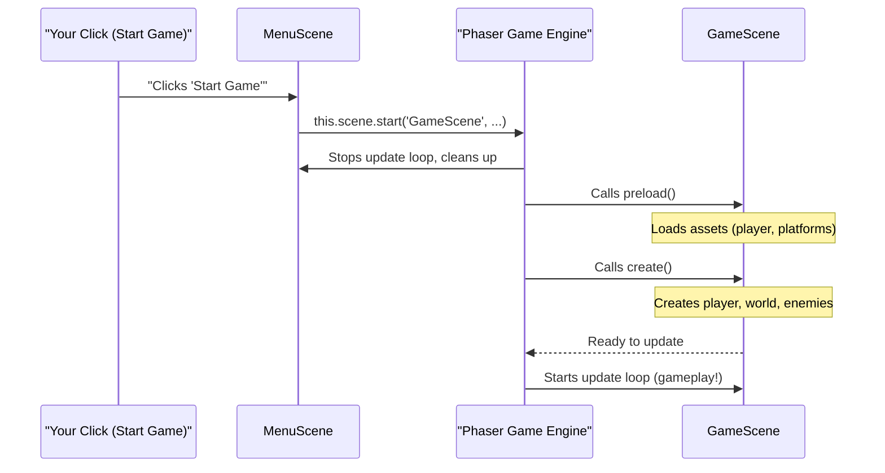
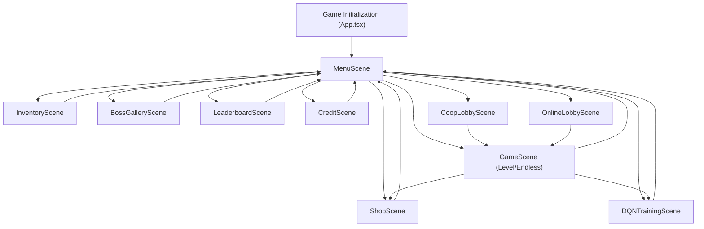

# Chapter 2: Phaser Scene System

Welcome back, brave adventurer! In [Chapter 1: Player & Combat System](01_player___combat_system_.md), we learned how to bring your hero to life, making them move, jump, and fight. You've got an amazing character, but *where* do they exist? What tells the game to show the main menu, then the actual gameplay, and then perhaps a shop?

That's where the **Phaser Scene System** comes in – it's like the different stages or acts in a play!

## What is the Phaser Scene System?

Imagine your game `JumpJumpJump` as a theatrical production. You wouldn't have the actors for the "Main Menu" scene and the "Actual Gameplay" scene on stage at the same time, right? That would be chaos! Instead, you have distinct stages for distinct parts of the story.

In Phaser, these "stages" are called **Scenes**.

A **Phaser Scene** is a self-contained part of your game that handles its own:
*   **Assets:** Images, sounds, and animations specific to that part of the game.
*   **Logic:** What happens in that part (e.g., menu button clicks, player movement, enemy AI).
*   **Display:** How everything looks on the screen.

When you switch between different sections of `JumpJumpJump` – like starting a new game, going to the shop, or checking the leaderboards – you're actually switching between these distinct scenes. They help organize your game into neat, manageable parts, making it much easier to build and understand the game's flow.

### Why Do We Need It? (The Problem)

The main problem the Phaser Scene System solves is: **How do we manage different game states and keep our code organized?** Without scenes, everything would be crammed into one giant file, making it impossible to add new features or fix bugs. Scenes provide a clear separation of concerns.

### Your First Adventure: Navigating the Game!

Let's trace a common path you might take in `JumpJumpJump`:
1.  You start the game and see the beautiful **Main Menu**. This is our `MenuScene`.
2.  You click "Start Game" and are whisked away into the action! Now you're in the `GameScene`.
3.  After collecting some coins, you want to buy an upgrade. You open the **Shop**. This is the `ShopScene`.
4.  Once you're done shopping, you want to return to the action or the main menu.

The Scene System orchestrates every one of these transitions, making sure the right content is shown at the right time.

## Key Concepts of Phaser Scenes

Let's break down the main ideas behind this system:

1.  **Self-Contained Logic:** Each scene is like its own mini-game. It only cares about what's happening within its own boundaries. This keeps your code clean and manageable.
2.  **Life Cycle Methods:** Scenes have special functions that run at specific times, like a play's script:
    *   `preload()`: Think of this as the stage crew setting up **before** the act begins. This is where the scene loads all its necessary images, sounds, and other data.
    *   `create()`: This is when the **curtain goes up!** All the elements are placed on the stage, characters appear, and initial game logic is set up.
    *   `update(time, delta)`: This is the director's continuous guidance, running **many times per second** while the scene is active. It's where all the action happens: checking for player input, moving enemies, updating scores, and so on.
3.  **Scene Management:** Phaser provides tools to switch between these scenes:
    *   `this.scene.start('SceneName')`: Stops the current scene and starts a new one, completely replacing it.
    *   `this.scene.launch('SceneName')`: Starts a new scene *on top* of the current one, without stopping the original. Useful for overlays like a pause menu. (For simplicity in this chapter, we'll mostly use `start`.)
    *   `this.scene.stop('SceneName')`: Stops a specific scene, but doesn't necessarily start another.
    *   `this.scene.restart()`: Restarts the current scene.

## How to Get Your Scenes Flowing (A Hands-On Look)

Let's look at how `JumpJumpJump` uses the Scene System to manage navigation.

### Step 1: Define Your Scenes

First, you need to create a new file for each scene. A basic scene structure looks like this:

```typescript
// frontend/src/scenes/MyCustomScene.ts
import Phaser from 'phaser'

export default class MyCustomScene extends Phaser.Scene {
  constructor() {
    // Give your scene a unique name (key)
    super('MyCustomScene')
  }

  preload() {
    // Load images, sounds, etc. here
    this.load.image('background', '/assets/background.png')
    console.log('🖼️ MyCustomScene: Assets loading...')
  }

  create() {
    // Create game objects, set up interactions
    this.add.image(640, 360, 'background') // Place background image
    this.add.text(640, 300, 'Welcome to My Scene!', { fontSize: '32px', color: '#ffffff' })
      .setOrigin(0.5)
    console.log('✨ MyCustomScene: Objects created.')
  }

  update(time: number, delta: number) {
    // Game logic that runs continuously
    // e.g., check for player input, move elements
  }
}
```
*What happens:* This code defines a new Phaser scene named `MyCustomScene`. When this scene starts, it will first `preload` a background image, then `create` that image and some text on the screen. The `update` method would then run constantly, ready for any interaction.

### Step 2: Register Your Scenes with Phaser

Before Phaser can use your scenes, you need to tell it about them. This happens in the main `App.tsx` file, where the Phaser game instance is created.

```typescript
// frontend/src/App.tsx (simplified excerpt)
import Phaser from 'phaser'
// Import all your scene files
import MenuScene from './scenes/MenuScene'
import GameScene from './scenes/GameScene'
import ShopScene from './scenes/ShopScene'
// ... other scenes ...

function App() {
  // ... other React state and effects ...

  useEffect(() => {
    // Only initialize Phaser when audio is ready
    if (!audioReady) return;

    const config: Phaser.Types.Core.GameConfig = {
      type: Phaser.AUTO,
      width: 1280,
      height: 720,
      parent: 'game-container',
      physics: {
        default: 'arcade',
        arcade: { gravity: { y: 400 } }
      },
      // THIS IS WHERE ALL YOUR SCENES ARE REGISTERED!
      scene: [MenuScene, GameScene, ShopScene], // List all your scenes here!
      scale: {
        mode: Phaser.Scale.FIT,
        autoCenter: Phaser.Scale.CENTER_BOTH,
        width: 1280,
        height: 720
      }
    }

    const newGame = new Phaser.Game(config)
    phaserGameRef.current = newGame;

    return () => {
      newGame.destroy(true)
    }
  }, [audioReady])

  // ... rest of the App component ...
}
```
*What happens:* The `scene` array in the `config` object tells Phaser all the scenes that exist in your game. Phaser knows their names (`'MenuScene'`, `'GameScene'`, etc.) and can switch between them. It will automatically start the *first* scene in this list when the game launches (in `JumpJumpJump`, this is the `MenuScene`).

### Step 3: Starting a Game (MenuScene -> GameScene)

When you click "Start Game" on the main menu, the `MenuScene` tells Phaser to switch to the `GameScene`.

```typescript
// frontend/src/scenes/MenuScene.ts (simplified excerpt)
import Phaser from 'phaser'

export default class MenuScene extends Phaser.Scene {
  // ... constructor, preload methods ...

  create() {
    // ... display title, player preview, etc. ...

    // Create a "LEVEL MODE" button
    const levelButton = this.add.rectangle(640, 410, 300, 60, 0x00aa00)
    levelButton.setInteractive({ useHandCursor: true })

    levelButton.on('pointerdown', () => {
      // This is the magic! Tell Phaser to start the 'GameScene'.
      // We can also pass data to the next scene.
      this.scene.start('GameScene', { gameMode: 'levels', level: 1 })
      console.log('🚀 MenuScene: Starting GameScene...')
    })

    const levelText = this.add.text(640, 410, 'LEVEL MODE', { /* ... styles ... */ })
    levelText.setOrigin(0.5)
  }
  // ... update method ...
}
```
*What happens:* When the `levelButton` is clicked, the `pointerdown` event triggers. Inside this event, `this.scene.start('GameScene', { ... })` is called. This tells Phaser: "Stop the current `MenuScene`, and load and start the `GameScene`. Also, pass this `gameMode` and `level` information to the `GameScene`." The `GameScene` will receive this data in its `init` method.

### Step 4: Going to Shop (GameScene -> ShopScene)

During gameplay, you might press a key or hit a specific area that takes you to the shop. The `GameScene` then tells Phaser to switch to the `ShopScene`.

```typescript
// frontend/src/scenes/GameScene.ts (simplified excerpt)
import Phaser from 'phaser'

export default class GameScene extends Phaser.Scene {
  // ... constructor, preload, create methods ...
  private playerCoins: number = 0; // Example coin count

  // The 'init' method receives data passed from the previous scene
  init(data: { gameMode: string, level: number }) {
    console.log(`🎮 GameScene: Initialized with mode ${data.gameMode} and level ${data.level}`)
    // You could initialize player, world based on this data
  }

  update(time: number, delta: number) {
    // ... player movement, enemy updates ...

    // Example: If player presses 'P' key to go to shop
    if (this.input.keyboard?.addKey('P').isDown) {
      // Pass player's current coins to the ShopScene
      this.scene.start('ShopScene', { coins: this.playerCoins })
      console.log(`🛍️ GameScene: Going to ShopScene with ${this.playerCoins} coins...`)
    }
  }
}
```
*What happens:* When the `P` key is detected, `this.scene.start('ShopScene', { coins: this.playerCoins })` is called. This stops the `GameScene` and launches the `ShopScene`, passing the player's current `coins` data along.

### Step 5: Returning to Menu (ShopScene -> MenuScene)

After you're done shopping, you'll want to go back to either the `GameScene` or the `MenuScene`. Let's say you go back to the `MenuScene`.

```typescript
// frontend/src/scenes/ShopScene.ts (simplified excerpt)
import Phaser from 'phaser'

export default class ShopScene extends Phaser.Scene {
  private coinCount: number = 0; // ShopScene will manage its own coin display

  constructor() {
    super('ShopScene')
  }

  // The 'init' method receives data passed from the previous scene
  init(data: { coins?: number }) {
    this.coinCount = data.coins || 0 // Get coins from previous scene, or default to 0
    console.log(`💰 ShopScene: Opened with ${this.coinCount} coins.`)
  }

  create() {
    // ... display shop items, prices, your coins ...

    // Create a "BACK TO MENU" button
    const backButton = this.add.rectangle(640, 680, 200, 50, 0x444444)
    backButton.setInteractive({ useHandCursor: true })

    backButton.on('pointerdown', () => {
      // When done, go back to the MenuScene.
      this.scene.start('MenuScene') // No data needed for MenuScene in this flow
      console.log('🚪 ShopScene: Returning to MenuScene...')
    })

    const backText = this.add.text(640, 680, 'BACK TO MENU', { /* ... styles ... */ })
    backText.setOrigin(0.5)

    // ESC key also returns to menu
    const escKey = this.input.keyboard!.addKey(Phaser.Input.Keyboard.KeyCodes.ESC)
    escKey.on('down', () => {
      this.scene.start('MenuScene')
    })
  }
  // ... update method ...
}
```
*What happens:* Clicking the `backButton` or pressing `ESC` calls `this.scene.start('MenuScene')`. This stops the `ShopScene` and brings you back to the main menu. Notice how the `init` method is used here to receive initial data (like the player's `coins`) when the scene starts.

## Inside the Phaser Scene System (How It Works)

Let's see the flow of a scene change.

### The Journey of a Scene (Non-Code Walkthrough)

When you tell Phaser to switch scenes, here's a simplified sequence of what happens:

1.  **Input Detected:** You, the player, press a button or click an option in the `MenuScene`.
2.  **Request Scene Change:** The `MenuScene` detects your input and calls `this.scene.start('GameScene')`.
3.  **Current Scene Shutdown:** Phaser receives the request. It first tells the `MenuScene` to shut down. This involves stopping its `update` loop and cleaning up its objects (like buttons, images, etc.).
4.  **Next Scene Initialization:** Phaser now prepares the `GameScene`.
    *   It calls the `GameScene`'s `preload()` method to load any assets specific to the game.
    *   Once assets are loaded, it calls the `GameScene`'s `create()` method, where all the game elements (player, platforms, enemies) are created and placed.
5.  **Next Scene Active:** The `GameScene` is now fully active, its `update()` method starts running, and gameplay begins!

Here's a simple diagram to illustrate this flow:



### Simplified Code Snippets (Core Scene Responsibilities)

The `frontend/src/scenes/` directory contains all the scene files. Let's look at the basic structure and responsibilities.

**1. `preload()` (Example from `MenuScene.ts`):**
This function runs once when the scene is loaded, to prepare all necessary resources.

```typescript
// Inside MenuScene.ts (simplified preload())
preload() {
  // Load UI assets like coin icon
  this.load.image('coin', '/assets/kenney_platformer-art-requests/Tiles/shieldGold.png')
  // Load various alien skins for player preview
  this.load.image('alienBeige_stand', '/assets/kenney_platformer-art-extended-enemies/Alien sprites/alienBeige_stand.png')
  // ... more alien skins ...
  console.log('✅ MenuScene assets loaded.')
}
```
*Explanation:* Before the `MenuScene` can show anything, it needs its images. This `preload` method tells Phaser to load the `coin` image and several `alien` character sprites from the `assets` folder. This ensures they are ready in memory when `create` needs them.

**2. `create()` (Example from `GameScene.ts`):**
This function also runs once, right after `preload` finishes (or immediately if there's no `preload`), to set up the scene's initial state.

```typescript
// Inside GameScene.ts (simplified create())
create() {
  // 1. Setup Physics World
  this.physics.world.gravity.y = 1000 // A heavy gravity for platformer feel
  
  // 2. Create Player
  // 'player' is the key for the player's image, '100, 450' is the starting position
  this.player = this.physics.add.sprite(100, 450, 'player_stand')
  this.player.setCollideWorldBounds(false) // Player can move beyond camera bounds (infinite world)
  
  // 3. Initialize Game Systems (e.g., World Generator, Player Manager)
  this.worldGenerator = new WorldGenerator(this, this.platforms)
  this.playerManager = new PlayerManager(this, this.audioManager)
  this.playerManager.create(this.platforms)

  // 4. Setup Collisions
  this.physics.add.collider(this.player, this.platforms)
  console.log('🚀 GameScene created: Player, World, Physics ready.')
}
```
*Explanation:* After `GameScene`'s assets are loaded, `create` springs into action. It sets up the game's gravity, brings the player character to life, initializes other important systems like the [World Generator](03_world_generator_.md) (which you'll learn about next!), and defines how the player interacts with platforms.

**3. `update()` (Example from `GameScene.ts`):**
This function runs many times per second, handling continuous game logic.

```typescript
// Inside GameScene.ts (simplified update())
update(time: number, delta: number) {
  // 1. Handle Input (from player or AI)
  const input = this.controls.getInput() // Get keyboard/gamepad input
  this.playerManager.update(input) // Tell the player to move/jump/shoot

  // 2. Update Game Systems
  this.worldGenerator.update(this.player.x) // Generate new platforms as player moves

  // 3. Check Game Over Condition
  if (this.player.y > this.cameras.main.height + 100) {
    console.log('💀 Player fell! Game Over.')
    this.scene.start('MenuScene') // Go back to the main menu
  }
}
```
*Explanation:* Every fraction of a second, the `update` method performs critical tasks: it checks what keys or buttons you're pressing and tells the `playerManager` (from [Chapter 1: Player & Combat System](01_player___combat_system_.md)) to react. It also updates the game world using the `worldGenerator`. If your player falls too far, it triggers a "Game Over" and sends you back to the `MenuScene`.

## All the Stages: Scenes in `JumpJumpJump`

`JumpJumpJump` uses many scenes to keep its diverse features organized. Here's a quick overview:

| Scene Name        | Purpose                                                                   | Key Logic                                                 |
| :---------------- | :------------------------------------------------------------------------ | :-------------------------------------------------------- |
| `MenuScene`       | Main entry point, navigation hub, game mode selection.                    | Display buttons, handle player name input, start other scenes. |
| `GameScene`       | The actual platformer gameplay, core game loop.                           | Player movement, combat, world generation, enemy AI.      |
| `ShopScene`       | Buy weapons and character skins with coins.                               | Display items, handle purchase logic, update coin count.  |
| `InventoryScene`  | Manage owned weapons and skins, equip/unequip.                            | Display owned items, handle equip actions.                |
| `BossGalleryScene`| View details of all bosses, track defeated status.                        | Fetch boss data, paginate display.                        |
| `LeaderboardScene`| Display online high scores, filter by game mode.                          | Fetch scores from backend, paginate.                      |
| `CreditScene`     | Show game credits and attributions.                                       | Display static text with animated background.             |
| `CoopLobbyScene`  | Local multiplayer lobby, gamepad detection, player ready status.          | Detect gamepads, manage player state, launch `GameScene` for co-op. |
| `OnlineLobbyScene`| Online multiplayer lobby, room creation, joining, chat.                   | Network communication, player sync, launch `GameScene` for online co-op. |
| `DQNTrainingScene`| Visualization and control for AI agent training.                          | Display AI stats, run training loops, interact with `GameScene` in AI mode. |

This table shows how each scene has a specific job, contributing to the overall game experience without cluttering other parts of the code.


*Explanation:* This diagram illustrates how `App.tsx` initializes all scenes, and how the `MenuScene` acts as the central hub, allowing you to navigate to almost any other part of the game. Other scenes also allow navigation back to the `MenuScene` or, in some cases, to other relevant scenes (e.g., `GameScene` to `ShopScene`).

## Conclusion

You've successfully explored the "Phaser Scene System," the powerful organizational tool that keeps `JumpJumpJump` structured and modular! You've learned how scenes act as distinct stages, each managing its own logic and display, and how to smoothly transition between them. This system is crucial for creating a complex game with multiple sections like menus, gameplay, and shops.

Now that you know how to structure your game into different sections, how do you actually build those endless, exciting levels within the `GameScene`? That's where the "World Generator" comes in.

[Next Chapter: World Generator](03_world_generator_.md)

---

<sub><sup>Generated by [AI Codebase Knowledge Builder](https://github.com/The-Pocket/Tutorial-Codebase-Knowledge).</sup></sub> <sub><sup>**References**: [[1]](https://github.com/aidenphangruiyin-cmyk/JumpJumpJump/blob/53ec676b48281d02cbc5a9f471a1a2545c901f91/README.md), [[2]](https://github.com/aidenphangruiyin-cmyk/JumpJumpJump/blob/53ec676b48281d02cbc5a9f471a1a2545c901f91/TECHNICAL_GUIDE.md), [[3]](https://github.com/aidenphangruiyin-cmyk/JumpJumpJump/blob/53ec676b48281d02cbc5a9f471a1a2545c901f91/frontend/src/App.tsx), [[4]](https://github.com/aidenphangruiyin-cmyk/JumpJumpJump/blob/53ec676b48281d02cbc5a9f471a1a2545c901f91/frontend/src/scenes/BossGalleryScene.ts), [[5]](https://github.com/aidenphangruiyin-cmyk/JumpJumpJump/blob/53ec676b48281d02cbc5a9f471a1a2545c901f91/frontend/src/scenes/CoopLobbyScene.ts), [[6]](https://github.com/aidenphangruiyin-cmyk/JumpJumpJump/blob/53ec676b48281d02cbc5a9f471a1a2545c901f91/frontend/src/scenes/CreditScene.ts), [[7]](https://github.com/aidenphangruiyin-cmyk/JumpJumpJump/blob/53ec676b48281d02cbc5a9f471a1a2545c901f91/frontend/src/scenes/DQNTrainingScene.ts), [[8]](https://github.com/aidenphangruiyin-cmyk/JumpJumpJump/blob/53ec676b48281d02cbc5a9f471a1a2545c901f91/frontend/src/scenes/InventoryScene.ts), [[9]](https://github.com/aidenphangruiyin-cmyk/JumpJumpJump/blob/53ec676b48281d02cbc5a9f471a1a2545c901f91/frontend/src/scenes/LeaderboardScene.ts), [[10]](https://github.com/aidenphangruiyin-cmyk/JumpJumpJump/blob/53ec676b48281d02cbc5a9f471a1a2545c901f91/frontend/src/scenes/MenuScene.ts), [[11]](https://github.com/aidenphangruiyin-cmyk/JumpJumpJump/blob/53ec676b48281d02cbc5a9f471a1a2545c901f91/frontend/src/scenes/OnlineLobbyScene.ts), [[12]](https://github.com/aidenphangruiyin-cmyk/JumpJumpJump/blob/53ec676b48281d02cbc5a9f471a1a2545c901f91/frontend/src/scenes/ShopScene.ts)</sup></sub>