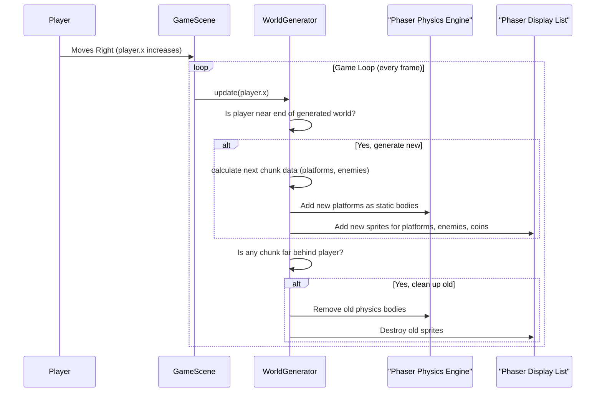

# Chapter 3: World Generator

Welcome back, intrepid game developer! In [Chapter 1: Player & Combat System](01_player___combat_system_.md), you mastered controlling your hero. Then, in [Chapter 2: Phaser Scene System](02_phaser_scene_system_.md), you learned how to organize your game into different sections like menus and the main gameplay. Now that you have a hero and a stage (the `GameScene`), how do you create an endless, ever-changing adventure for them to explore?

That's precisely what the **World Generator** is for!

## What is the World Generator?

Imagine having an **infinite architect** working tirelessly behind the scenes for your game levels. Instead of building huge, static maps that eventually end, the `WorldGenerator` continuously builds brand new platforms, spawns enemies, places coins, and even throws in challenging spikes, just a little bit ahead of your player as they move forward.

And it's smart too! It knows when parts of the world are far behind the player and are no longer needed. Like a tidy architect, it cleans up these old sections to save the computer's memory, ensuring the game runs smoothly forever. This system lets `JumpJumpJump` offer endless gameplay with varied terrain and increasing difficulty, so the adventure never gets boring!

### Why Do We Need It? (The Problem)

The main problem the `WorldGenerator` solves is: **How can we create an infinite, fresh, and challenging game world without running out of space or memory?** If we pre-build everything, the game would be massive, repetitive, and eventually end. The `WorldGenerator` makes `JumpJumpJump` truly endless!

### Your First Adventure: Exploring an Endless World!

Let's look at how the `WorldGenerator` makes `JumpJumpJump` an endless adventure:

1.  Your hero starts in the `GameScene` on a safe platform.
2.  You **run** to the right, jumping across gaps and stomping enemies.
3.  As you move, new platforms and enemies **magically appear** in front of you.
4.  Behind you, platforms you've already passed **vanish** to keep the game fast.
5.  This process **repeats forever**, creating an infinite, fresh journey!

The `WorldGenerator` handles every part of this magical process, making sure your game world always feels new and exciting.

## Key Concepts of Your Infinite Architect

Let's break down the main ideas behind this system:

1.  **Infinite World:** The game world never truly ends. As long as you keep moving, new content keeps appearing.
2.  **Procedural Generation:** Instead of hand-placing every platform and enemy, the game uses a set of rules and random choices to *generate* them on the fly. This means every playthrough can be a little different!
3.  **Chunks:** To manage this endless world, it's broken down into smaller, manageable sections called "chunks." Think of them as individual building blocks. The `WorldGenerator` creates and destroys these chunks.
4.  **Memory Management:** The game only keeps the parts of the world near the player in memory. Old chunks that are far behind are cleaned up, preventing the game from slowing down over time.
5.  **Variety & Difficulty Scaling:** The `WorldGenerator` uses different "biomes" (like metal, stone, or dirt themes) and also gradually increases the number of enemies, their speed, and the size of gaps as you progress, keeping the challenge fresh.
6.  **Deterministic Generation (Seed):** If you use a special "seed" number, the `WorldGenerator` will create the *exact same* world layout every time for that seed. This is great for competitive play or if you want to replay a particularly cool level.

## How to Get Your World Generating (A Hands-On Look)

The `WorldGenerator` is used primarily within the `GameScene` because that's where the actual gameplay happens.

### Step 1: Initialize the World Generator

Before the world can start building itself, you need to create an instance of the `WorldGenerator` in your `GameScene`'s `create()` method. Remember, `create()` runs once when the scene starts!

```typescript
// Inside frontend/src/scenes/GameScene.ts (simplified excerpt)
import Phaser from 'phaser'
import { WorldGenerator } from '../utils/WorldGenerator' // Import the WorldGenerator

export default class GameScene extends Phaser.Scene {
  private player!: Phaser.Physics.Arcade.Sprite
  private platforms!: Phaser.Physics.Arcade.StaticGroup // Group for ground and platforms
  private spikes!: Phaser.Physics.Arcade.StaticGroup // Group for spike hazards
  private worldGenerator!: WorldGenerator // Declare the WorldGenerator

  create() {
    // ... setup physics, player, etc. (from previous chapters) ...

    this.platforms = this.physics.add.staticGroup() // Initialize platforms group
    this.spikes = this.physics.add.staticGroup() // Initialize spikes group
    const spikePositions: Array<{x: number, y: number, width: number}> = [] // Array to track spike locations

    // Create the WorldGenerator!
    // It needs the scene, the groups for platforms and spikes, and a place to track spike positions.
    this.worldGenerator = new WorldGenerator(this, this.platforms, this.spikes, spikePositions)

    // Tell the WorldGenerator to create the initial part of the world, including the safe spawn platform.
    this.worldGenerator.generateWorld()

    // ... setup collisions with platforms (e.g., this.physics.add.collider(this.player, this.platforms)) ...
  }
}
```
*What happens:* This code creates a new `WorldGenerator` object, giving it access to the current `GameScene` and the special `Phaser.Physics.Arcade.StaticGroup` objects (`platforms` and `spikes`) where it will place game objects. It then calls `generateWorld()` to build the very first part of your level, including a safe starting area.

### Step 2: Continuously Update the World

Once the `WorldGenerator` is created, you need to tell it to check if new parts of the world are needed (or if old parts can be cleaned up) in every frame of the game. This happens in the `GameScene`'s `update()` method, which runs many times per second.

```typescript
// Inside frontend/src/scenes/GameScene.ts (simplified excerpt)
import { PlayerInput } from '../types/GameTypes' // Assuming PlayerInput is defined

export default class GameScene extends Phaser.Scene {
  // ... properties like player, worldGenerator, etc. ...
  
  update(time: number, delta: number) {
    // ... handle player input, update player manager (from Chapter 1) ...

    // Tell the WorldGenerator to update based on the player's X position.
    // This is the magic that makes the world endless!
    this.worldGenerator.update(this.player.x)

    // ... check for game over conditions, etc. ...
  }
}
```
*What happens:* Every time `update()` runs, the game tells the `worldGenerator` where the player is (`this.player.x`). The `worldGenerator` then uses this information to decide if it needs to build new chunks ahead or remove old chunks behind the player.

## Inside the World Generator (How It Works)

Let's peel back the curtain and see how our infinite architect does its job. The main logic resides in `frontend/src/utils/WorldGenerator.ts`.

### The Journey of an Endless World (Non-Code Walkthrough)

Here's a simplified step-by-step look at what happens when the `WorldGenerator` continuously updates the world:

1.  **Player Moves:** Your hero runs to the right, increasing their `player.x` position.
2.  **Update Check:** In the `GameScene`'s `update()` method, it regularly asks the `WorldGenerator` to update, passing the `player.x`.
3.  **Generation Decision:** The `WorldGenerator` checks if the `player.x` is getting close to the edge of the *currently generated* world.
    *   If the player is, it calculates the next "chunk" (a building block of the world) and tells Phaser to create new platforms, enemies, and items in that chunk.
    *   It ensures these new chunks have consistent biomes (like metal or dirt) and a logical flow.
4.  **Cleanup Decision:** At the same time, the `WorldGenerator` checks if any chunks are far behind the `player.x` (e.g., two screen-widths away).
    *   If they are, it tells Phaser to destroy all the game objects (platforms, enemies) in those old chunks, freeing up memory.
5.  **Repeat:** This cycle of generating new content ahead and cleaning up old content behind continues indefinitely, creating the illusion of an infinite world.

Here's a simple diagram to illustrate this flow:



### Simplified Code Snippets (Under the Hood)

Let's peek at some simplified parts of the `WorldGenerator.ts` file.

**1. Initializing the World (`generateWorld()`):**
This function sets up the very first part of the game world, including a safe area for the player to start.

```typescript
// Inside WorldGenerator.ts (simplified generateWorld())
generateWorld(): number {
  const tileSize = 70
  const floorY = 650 // Ground level Y position
  const spawnPlatformWidth = 500 // How wide the starting platform is

  // Create the safe starting platform
  for (let x = 0; x < spawnPlatformWidth; x += tileSize) {
    const tile = this.scene.add.sprite(x + tileSize/2, floorY, 'metalMid')
    this.scene.physics.add.existing(tile, true) // Add as static physics body
    this.platforms.add(tile) // Add to the platforms group
  }
  
  // Set the starting point for further chunk generation
  this.worldGenerationX = spawnPlatformWidth
  
  // Generate a few more chunks immediately to fill the initial screen
  for (let i = 0; i < 5; i++) {
    this.generateChunk(this.worldGenerationX)
    this.worldGenerationX += 800 // Each chunk is 800px wide
  }
  
  this.lastGeneratedX = this.worldGenerationX // Keep track of where we last generated
  return this.worldGenerationX // Return the end X of generated world
}
```
*Explanation:* This code lays down the first few platforms, creating a solid ground for your player to stand on. It then generates several "chunks" to ensure the initial screen view is filled with playable content.

**2. Generating a Single Chunk (`generateChunk(startX)`):**
This is the core of the procedural generation. It defines what a single chunk contains.

```typescript
// Inside WorldGenerator.ts (simplified generateChunk(startX))
generateChunk(startX: number) {
  this.resetRngForChunk(startX) // Important for deterministic levels!
  const chunkWidth = 800
  const floorY = 650
  const currentBiome = this.getBiomeForX(startX) // Get the current biome (metal, stone, dirt)
  const platformTexture = this.getBiomePlatformTileForBiome(currentBiome)

  // Create the ground floor for this chunk
  // (Similar loop as in generateWorld, but uses biome-specific textures)
  for (let x = startX; x < startX + chunkWidth; x += 70) {
    const tileTexture = this.getBiomeFloorTileForBiome(this.getBiomeForX(x))
    const floorTile = this.scene.add.sprite(x + 70/2, floorY, tileTexture)
    this.scene.physics.add.existing(floorTile, true)
    this.platforms.add(floorTile)
  }

  // Generate platforms, spikes, enemies, etc., using random values
  // This is where the procedural magic happens!
  const numPlatforms = this.seededBetween(3, 5) // Use seeded random!
  for (let i = 0; i < numPlatforms; i++) {
    const x = startX + this.seededBetween(100, chunkWidth - 100)
    const y = floorY - this.seededBetween(200, 400) // Random height above ground
    
    // Create platform (actual texture depends on current biome)
    const platform = this.scene.add.sprite(x, y, platformTexture)
    this.scene.physics.add.existing(platform, true)
    this.platforms.add(platform)

    // Add enemies, coins, and spikes probabilistically on this platform
    if (this.seededRandom() < 0.2) { // 20% chance for enemy
      this.scene.enemiesManager.spawnEnemy(x, y - 50) // Simplified call to an Enemy Manager
    }
    if (this.seededRandom() < 0.4) { // 40% chance for coin
      this.scene.coinsManager.spawnCoin(x, y - 40) // Simplified call to a Coin Manager
    }
    if (this.seededRandom() < 0.15) { // 15% chance for spike
      this.spikes.create(x, floorY - 70/2, 'spikes') // Place a spike on the ground
    }
  }
}
```
*Explanation:* This function is the workhorse. It determines the current "biome" (e.g., `metal`, `stone`, or `dirt`), which affects the textures of the platforms. It then uses `seededBetween()` and `seededRandom()` (special functions that produce predictable random numbers based on a "seed" for consistent levels) to decide where to place platforms, enemies, coins, and spikes within this 800-pixel wide chunk.

**3. Updating and Cleaning Up (`update(playerX)`):**
This function is called in the `GameScene`'s `update()` loop and manages the generation and cleanup.

```typescript
// Inside WorldGenerator.ts (simplified update(playerX))
update(playerX: number) {
  const chunkWidth = 800
  const generationDistance = 2 * chunkWidth // Generate 2 chunks ahead
  const cleanupDistance = 2 * chunkWidth // Clean up 2 chunks behind

  // Generate new chunks if player is approaching the end of the generated world
  if (playerX + generationDistance > this.lastGeneratedX) {
    this.generateChunk(this.lastGeneratedX)
    this.lastGeneratedX += chunkWidth
  }

  // Clean up chunks that are far behind the player
  const currentChunkIndex = Math.floor(playerX / chunkWidth)
  const cleanupChunkIndex = currentChunkIndex - 2 // Clean up chunks 2 behind player

  // A more robust cleanup involves iterating through existing objects
  // and checking their X position. For simplicity, imagine a function:
  this.cleanupOldChunks(cleanupChunkIndex * chunkWidth) // Destroy objects before this X
}

// Simplified example of what cleanupOldChunks might do (not actual code snippet)
private cleanupOldChunks(cleanupX: number) {
  this.platforms.children.each((child) => {
    const platform = child as Phaser.Physics.Arcade.Sprite
    if (platform.x < cleanupX) {
      platform.destroy() // Remove the platform sprite
    }
  })
  // Do similar for enemies, coins, spikes, etc.
}
```
*Explanation:* The `update` method constantly checks the player's position. If the player moves far enough to the right, it calls `generateChunk()` to add new content. If the player has moved far enough past old content, it calls `cleanupOldChunks()` to remove them from the game, saving memory and keeping the game running fast.

## What a Chunk Can Contain

A single 800-pixel wide chunk in `JumpJumpJump` is a mini-level in itself, filled with various elements to keep the player engaged:

| Element Type     | Description                                                     | Purpose                                       |
| :--------------- | :-------------------------------------------------------------- | :-------------------------------------------- |
| **Platforms**    | Horizontal surfaces to jump on, made of metal, stone, or dirt.  | Player movement, obstacle creation            |
| **Enemies**      | Various creatures (slimes, flies) that patrol or fly.           | Combat, challenge, score points               |
| **Coins**        | Shiny gold coins scattered around.                              | Collectibles, score, in-game currency         |
| **Spike Hazards**| Dangerous spike traps, usually on the ground.                   | Avoidance, damage on contact                  |
| **Power-ups**    | Special items (speed boost, shield, extra life).                | Temporary buffs, strategic advantage          |

This rich variety within each chunk ensures that even though the world is procedurally generated, it feels dynamic and challenging.

## Conclusion

You've successfully explored the "World Generator," the infinite architect behind `JumpJumpJump`'s endless levels! You've learned how it uses procedural generation and chunks to create a continuously evolving world, while also intelligently managing memory. This system is key to making your adventure feel limitless and fresh every time you play.

Now that your player can move and an endless world exists, how does the game show you your score, health, or weapon reload progress? That's where the "UI Manager" comes in.

[Next Chapter: UI Manager](04_ui_manager.md)

---

<sub><sup>Generated by [AI Codebase Knowledge Builder](https://github.com/The-Pocket/Tutorial-Codebase-Knowledge).</sup></sub> <sub><sup>**References**: [[1]](https://github.com/aidenphangruiyin-cmyk/JumpJumpJump/blob/53ec676b48281d02cbc5a9f471a1a2545c901f91/PRPs/Core-Game-Mechanics-World-Generation.md), [[2]](https://github.com/aidenphangruiyin-cmyk/JumpJumpJump/blob/53ec676b48281d02cbc5a9f471a1a2545c901f91/PRPs/Core-Game-Mechanics-World-Generation_cn.md), [[3]](https://github.com/aidenphangruiyin-cmyk/JumpJumpJump/blob/53ec676b48281d02cbc5a9f471a1a2545c901f91/TECHNICAL_GUIDE.md), [[4]](https://github.com/aidenphangruiyin-cmyk/JumpJumpJump/blob/53ec676b48281d02cbc5a9f471a1a2545c901f91/frontend/src/types/GameTypes.ts), [[5]](https://github.com/aidenphangruiyin-cmyk/JumpJumpJump/blob/53ec676b48281d02cbc5a9f471a1a2545c901f91/frontend/src/utils/WorldGenerator.ts)</sup></sub>