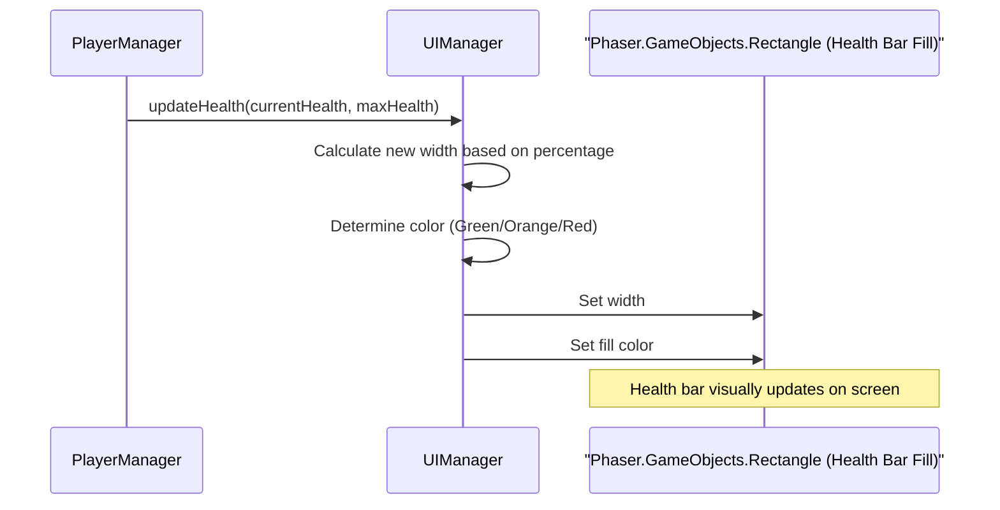

# Chapter 4: UI Manager

Welcome back, game adventurer! In [Chapter 1: Player & Combat System](01_player___combat_system_.md), you learned how to control your hero. In [Chapter 2: Phaser Scene System](02_phaser_scene_system_.md), you saw how to organize your game into different screens. And in [Chapter 3: World Generator](03_world_generator_.md), you discovered how to create endless levels.

Now, imagine playing `JumpJumpJump` without knowing how much health you have, what your score is, or if your weapon is ready to fire. It would be impossible to strategize or even know if you're doing well!

This is where the **UI Manager** comes in – it's your window into everything important happening in the game, always keeping you informed without interrupting the action.

## What is the UI Manager?

Think of the `UIManager` as the game's **Head-Up Display (HUD)** or your car's dashboard. It's the system that constantly updates and shows you all the critical information about your game state right on the screen, overlaid on top of the actual gameplay. It doesn't move your character or generate levels; its job is purely to *display* data in an easy-to-understand way.

This includes visible elements like:
*   Your **health bar** (changing color as you take damage!).
*   How many **lives** you have left.
*   Your current **score** and **coins** collected.
*   The **reload bar** for your weapon.
*   Important messages like **tips** or **power-up notifications**.
*   Even **technical data** like Frames Per Second (FPS) if you enable debug mode!

In multiplayer modes, it smartly adapts to show information for multiple players, ensuring everyone has a clear overview of their own status.

### Why Do We Need It? (The Problem)

The main problem the `UIManager` solves is: **How do we clearly and constantly inform the player about their status and game progress without cluttering the main game logic?** Without a dedicated manager, every part of the game (player, enemies, power-ups) would try to update its own display, leading to messy code and hard-to-manage visuals. The `UIManager` centralizes all display logic into one organized place.

### Your First Adventure: Staying Informed!

Let's trace a common scenario in `JumpJumpJump` and see the `UIManager` in action:

1.  You are happily jumping through a level. At the top-left, you see your **health bar is full green**, and you have **3 lives**. In the middle, your **score is 1200**, and on the right, you've collected **50 coins**.
2.  An enemy sneaks up and hits you! Instantly, your **health bar shrinks a bit** and turns **orange**, indicating you've taken damage. A small `"-10"` pops up above your head.
3.  You collect a shiny coin! Your **coin count instantly updates to 51**, and a small `"+10"` score popup appears.
4.  Your weapon is cooling down. A **small reload bar** fills up in the corner, showing you when you can shoot again.
5.  You pick up a "Speed Boost" power-up. A temporary **"Speed Boost Active!" message** flashes on the screen.

The `UIManager` is responsible for every single one of these visual updates, making sure you always know exactly what's going on!

## Key Concepts of Your Information Dashboard

Let's break down the main ideas behind this system:

1.  **Centralized Display:** All on-screen game information (HUD) is managed in one place, making it easy to create, update, and remove.
2.  **Dynamic Updates:** Information like health, score, and reload progress isn't static; it changes in real-time as gameplay unfolds.
3.  **Visual Feedback:** It uses colors (like the health bar), pop-up texts (damage numbers, score increments), and icons (coins, power-ups) to convey information quickly.
4.  **Scroll Factor 0:** This is a Phaser trick! It means UI elements (`setScrollFactor(0)`) stay fixed on the screen, no matter where the camera moves in the game world. They don't scroll with the background.
5.  **Depth Layering:** UI elements are always displayed on top of the game world. `setDepth(100)` or higher ensures they are always visible.
6.  **Contextual Display:** It adapts to different game modes (single-player vs. co-op) or debug states, showing only the relevant information.

## How to Get Your UI Displaying (A Hands-On Look)

The `UIManager` is mainly used within the `GameScene` because that's where all the action and data it needs to display are present.

### Step 1: Initialize the UI Manager

Just like other managers, you need to create an instance of the `UIManager` in your `GameScene`'s `create()` method. Remember, `create()` runs once when the scene starts!

```typescript
// Inside frontend/src/scenes/GameScene.ts (simplified excerpt)
import Phaser from 'phaser'
import { UIManager } from '../managers/UIManager' // Import the UIManager
import { GameMode } from '../types/GameTypes' // Needed for game mode

export default class GameScene extends Phaser.Scene {
  // ... other properties ...
  private uiManager!: UIManager // Declare the UIManager

  create() {
    // ... setup physics, player, world generator, etc. ...

    // Configure the UIManager (e.g., based on game mode from MenuScene)
    const uiConfig = { isCoopMode: false, screenWidth: 1280, screenHeight: 720 }
    
    // Create the UIManager!
    this.uiManager = new UIManager(this, uiConfig)
    
    // Tell the UIManager to create all the initial UI elements
    // We pass the current level and game mode.
    this.uiManager.create(1, 'levels' as GameMode) 

    // ... setup collisions, etc. ...
  }
}
```
*What happens:* This code creates a new `UIManager` object, giving it access to the current `GameScene`. It then calls the `create()` method of the `UIManager` to build all the initial UI components, like the empty health bar, the "Lives: 3" text, "Score: 0", and the coin display. These elements are now ready on screen.

### Step 2: Update UI Elements as Game State Changes

Throughout the game, whenever something important changes (player health, score, coins, etc.), other parts of the game (like the [Player & Combat System](01_player___combat_system_.md)) will tell the `UIManager` to update the display. This usually happens in the `GameScene`'s `update()` method, or directly from other manager classes.

```typescript
// Example: Inside frontend/src/managers/PlayerManager.ts (simplified excerpt)
// When player takes damage
private handleDamage(damageAmount: number): void {
  this.state.health -= damageAmount // Decrease player health
  this.scene.events.emit(GAME_EVENTS.PLAYER_DAMAGED, this.state.health, this.state.maxHealth)
  
  // This is where the UI Manager gets updated!
  this.scene.uiManager.updateHealth(this.state.health, this.state.maxHealth)
  
  // Show a damage number popup where the player was hit
  this.scene.uiManager.showDamageNumber(this.player.x, this.player.y, damageAmount)
  // ... other damage logic (damage flash, check if dead) ...
}

// When player collects a coin
private collectCoin(coin: Phaser.GameObjects.Sprite): void {
  this.state.coins += 1 // Increase coin count
  this.state.score += 10 // Increase score
  
  // Update the UI for coins and score
  this.scene.uiManager.updateCoins(this.state.coins)
  this.scene.uiManager.updateScore(this.state.score)
  
  // Show a score popup where the coin was
  this.scene.uiManager.showScorePopup(coin.x, coin.y, 10)
  // ... destroy coin, play sound ...
}
```
*What happens:* Whenever the player takes damage or collects a coin, the `PlayerManager` (which controls the player's internal state) calls specific methods on the `uiManager` (like `updateHealth` or `updateCoins`). These calls pass the new values, and the `uiManager` then updates the visual elements on the screen. It also triggers special temporary UI elements like damage or score pop-ups.

## Inside the UI Manager (How It Works)

Let's see how the `UIManager` takes raw data and turns it into dynamic on-screen information. The main logic resides in `frontend/src/managers/UIManager.ts`, and the types are defined in `frontend/src/types/GameTypes.ts`.

### The Journey of a Health Update (Non-Code Walkthrough)

Here's a simplified step-by-step look at what happens when your player's health changes:

1.  **Damage Occurs:** Your player character takes damage (e.g., from an enemy, spike, or falling).
2.  **Health Value Changes:** The [Player & Combat System](01_player___combat_system_.md) updates the player's internal `health` value.
3.  **Request UI Update:** The `PlayerManager` (part of the Player & Combat System) then calls the `UIManager.updateHealth()` method, passing the player's new `health` and `maxHealth`.
4.  **Calculate Display:** The `UIManager` calculates the new width for the health bar based on the `health / maxHealth` ratio. It also determines the appropriate color (green, orange, or red) based on the health percentage.
5.  **Update Visuals:** The `UIManager` then directly manipulates the Phaser `Rectangle` object that represents the health bar's "fill," changing its `width` and `color`.
6.  **Player Sees Update:** The health bar on the screen instantly reflects the damage taken, providing immediate feedback to the player.

Here's a simple diagram to illustrate this flow:



### Simplified Code Snippets (Under the Hood)

Let's peek at some simplified parts of the `UIManager.ts` file to see how these UI elements are managed.

**1. Creating the Health Bar (`createHealthBar()`):**
This function is called once during `UIManager.create()` to set up the health bar's background and fill.

```typescript
// Inside UIManager.ts (simplified createHealthBar())
private createHealthBar(): void {
  const x = 20; const y = 20; const width = 200; const height = 25;

  // Background rectangle (always visible)
  this.elements.healthBarBg = this.scene.add.rectangle(x, y, width, height, 0x333333)
  this.elements.healthBarBg.setOrigin(0, 0)
  this.elements.healthBarBg.setScrollFactor(0) // Fixed on screen
  this.elements.healthBarBg.setDepth(100) // Render on top

  // Fill rectangle (its width and color will change)
  this.elements.healthBarFill = this.scene.add.rectangle(x + 2, y + 2, width - 4, height - 4, 0x00ff00)
  this.elements.healthBarFill.setOrigin(0, 0)
  this.elements.healthBarFill.setScrollFactor(0) // Fixed on screen
  this.elements.healthBarFill.setDepth(101) // Render on top of background

  // Label text
  this.scene.add.text(x, y - 18, 'HP', { fontSize: '14px', color: '#ffffff' })
    .setScrollFactor(0).setDepth(102)
}
```
*Explanation:* This code creates two `Phaser.GameObjects.Rectangle` objects: one for the dark background of the health bar, and one for the green "fill" that actually shows your health. Both are set to `setScrollFactor(0)` so they stay put on the screen, and `setDepth` to ensure they appear on top of everything else. It also adds a small "HP" label.

**2. Updating the Health Bar (`updateHealth()`):**
This function is called repeatedly by other game systems whenever the player's health changes.

```typescript
// Inside UIManager.ts (simplified updateHealth())
updateHealth(health: number, maxHealth: number): void {
  const healthPercent = health / maxHealth // Calculate health as a percentage
  const maxWidth = 196 // Full width of the fill (200 - 4 for padding)

  // Update the width of the health bar fill
  this.elements.healthBarFill.width = maxWidth * healthPercent

  // Change color based on health percentage
  if (healthPercent > 0.6) {
    this.elements.healthBarFill.setFillStyle(0x00ff00) // Green (high health)
  } else if (healthPercent > 0.3) {
    this.elements.healthBarFill.setFillStyle(0xffaa00) // Orange (medium health)
  } else {
    this.elements.healthBarFill.setFillStyle(0xff0000) // Red (low health)
  }
}
```
*Explanation:* This code takes the `current health` and `maximum health` and calculates a percentage. It then adjusts the `width` of the `healthBarFill` rectangle to match this percentage. Crucially, it also changes the fill `color` to give a quick visual cue: green for good health, orange for caution, and red for danger.

**3. Showing a Temporary Tip (`showTip()`):**
This function creates a message that fades in and out, useful for notifications.

```typescript
// Inside UIManager.ts (simplified showTip())
showTip(message: string, duration: number = 3000): void {
  const tip = this.scene.add.text( // Create text in center-bottom
    this.config.screenWidth / 2, this.config.screenHeight - 100, message,
    { fontSize: '24px', color: '#ffffff', backgroundColor: '#000000', padding: { x: 20, y: 10 } }
  )
  tip.setOrigin(0.5) // Center the text
  tip.setScrollFactor(0) // Keep it fixed on screen
  tip.setDepth(500) // Very high depth to always be on top
  tip.setAlpha(0) // Start completely transparent

  // Fade in the tip
  this.scene.tweens.add({
    targets: tip,
    alpha: 1, // Fade to fully visible
    duration: 300,
    onComplete: () => {
      // After fading in, wait, then fade out and destroy
      this.scene.time.delayedCall(duration - 600, () => {
        this.scene.tweens.add({
          targets: tip,
          alpha: 0, // Fade to transparent
          duration: 300,
          onComplete: () => tip.destroy() // Remove from game
        })
      })
    }
  })
}
```
*Explanation:* This method creates a `Phaser.GameObjects.Text` object for the tip. It's positioned in the center-bottom of the screen, fixed, and on a high `depth` layer. It starts invisible (`alpha: 0`). Phaser's `tweens` system is then used to smoothly `fade in` the text, `wait` for a bit, and then smoothly `fade out` and `destroy` it, making it a temporary, non-intrusive notification.

## The Dashboard Elements: What the UI Manager Displays

The `UIManager` handles a wide array of visual information to keep the player informed:

| UI Element          | Description                                                    | Purpose                                          |
| :------------------ | :------------------------------------------------------------- | :----------------------------------------------- |
| **Health Bar**      | Visual representation of player's current health, changes color. | Crucial combat feedback, survival status         |
| **Lives Counter**   | Number of remaining lives.                                     | Overall game progress, retry chances             |
| **Score Text**      | Current score and high score.                                  | Performance tracking, competition                |
| **Coin Text & Icon**| Number of collected coins.                                     | Currency for shop, score bonus                   |
| **Level Indicator** | Shows current level or "Endless" mode.                         | Progression tracking                             |
| **Weapon Reload Bar**| Visualizes weapon cooldown.                                    | Tactical feedback for combat timing              |
| **Debug Info**      | FPS, player coordinates (X, Y).                                | Developer/debugger information                   |
| **Tips/Messages**   | Temporary pop-up texts for notifications.                      | In-game hints, power-up status                   |
| **Damage Numbers**  | Small numbers popping up when damage occurs.                   | Direct feedback on combat effectiveness          |
| **Score Popups**    | Small numbers popping up when points are gained.               | Direct feedback on collectible/enemy value       |
| **Boss Health Bar** | Special health bar for boss fights.                            | Strategic information during boss encounters     |
| **AI Status**       | Shows if an AI agent is active (for training mode).            | Specific to AI development, not regular gameplay |

This table shows the comprehensive nature of the `UIManager`, displaying everything from vital gameplay stats to developer tools.

## Conclusion

You've successfully explored the "UI Manager," the game's essential information dashboard! You've learned how it centralizes the display of crucial game data, provides dynamic visual feedback, and keeps you constantly informed without interfering with gameplay. This system is vital for a clear and engaging player experience.

Now that your player can move, the world is endless, and you have clear UI, how do you bring other players into the action, whether side-by-side or across the internet? That's where the "Multiplayer System" comes in.

[Next Chapter: Multiplayer System](05_multiplayer_system.md)

---

<sub><sup>Generated by [AI Codebase Knowledge Builder](https://github.com/The-Pocket/Tutorial-Codebase-Knowledge).</sup></sub> <sub><sup>**References**: [[1]](https://github.com/aidenphangruiyin-cmyk/JumpJumpJump/blob/53ec676b48281d02cbc5a9f471a1a2545c901f91/frontend/src/managers/UIManager.ts), [[2]](https://github.com/aidenphangruiyin-cmyk/JumpJumpJump/blob/53ec676b48281d02cbc5a9f471a1a2545c901f91/frontend/src/managers/index.ts), [[3]](https://github.com/aidenphangruiyin-cmyk/JumpJumpJump/blob/53ec676b48281d02cbc5a9f471a1a2545c901f91/frontend/src/types/GameTypes.ts)</sup></sub>