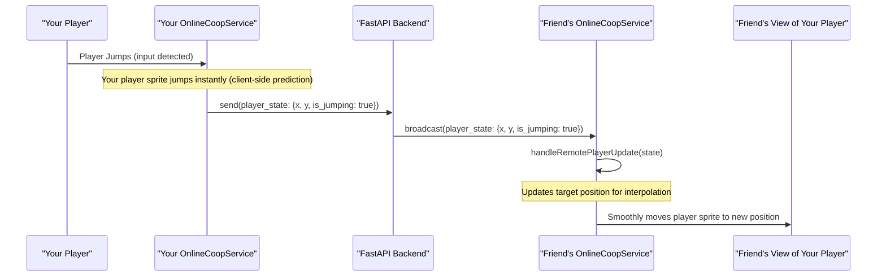

# Chapter 5: Multiplayer System

Welcome back, intrepid developer! In [Chapter 1: Player & Combat System](01_player___combat_system_.md), you breathed life into your hero. [Chapter 2: Phaser Scene System](02_phaser_scene_system_.md) taught you how to build distinct areas like menus and levels. [Chapter 3: World Generator](03_world_generator_.md) showed you how to craft endless, unique levels, and [Chapter 4: UI Manager](04_ui_manager_.md) made sure you always knew your health and score.

But what if you don't want to jump and fight alone? What if you want to team up with a friend, side-by-side or across continents, to conquer the challenges of `JumpJumpJump`? That's where the **Multiplayer System** comes into play!

## What is the Multiplayer System?

The **Multiplayer System** is the magic that lets you share your `JumpJumpJump` adventures with other players. It's like having a special communication network and coordination team built right into the game.

It has two main parts:

1.  **`LocalCoopManager`**: Imagine you and a friend sitting on the same couch, both holding gamepads. The `LocalCoopManager` is the brain that lets you both play on the *same computer* and *same screen*. It handles each of your controls, keeps track of your actions, and makes sure the game knows who's doing what without getting confused.
2.  **`OnlineCoopService`**: Now imagine your friend lives far away, or you want to team up with someone across the internet. The `OnlineCoopService` is your internet connection to the game world. It connects players over the internet, manages "game rooms" where you can meet, and most importantly, it `synchronizes` everyone's movements and actions. This means if you jump on your screen, your friend sees you jump on *their* screen at almost the exact same time, creating a smooth shared experience.

This system is the essential glue that lets players jump, fight, and experience the game's endless worlds alongside each other.

### Why Do We Need It? (The Problem)

The main problem the Multiplayer System solves is: **How do we allow multiple players to experience the same game world together, accurately and smoothly, regardless of whether they are in the same room or miles apart?** Without it, `JumpJumpJump` would be a lonely adventure!

### Your First Adventure: Playing with a Friend!

Let's imagine you want to play `JumpJumpJump` with a friend:

1.  You open the game and navigate to the **Multiplayer** section.
2.  You decide if you want to play:
    *   **Side-by-Side (Local Co-op):** You both grab gamepads, pick your characters, and launch directly into the same game on your computer.
    *   **Across the Internet (Online Co-op):** You create a "room" or join a friend's room, wait for them to connect, and then start the game, seeing each other's characters move in real-time.
3.  No matter which you choose, the game manages all the complex behind-the-scenes work to ensure you and your friend have a fun, synchronized experience!

The Multiplayer System makes these scenarios possible, keeping track of everyone and making sure the game works perfectly for all players.

## Key Concepts of Cooperative Play

Let's break down the main ideas behind this system:

1.  **Local Co-op (Shared Screen):**
    *   **Two Players, One Screen:** Both players share the same display. The camera smartly tries to keep both players in view, often by centering between them.
    *   **Separate Gamepads:** Each player uses their own gamepad (or a keyboard for one player) for independent control.
    *   **Shared State or Individual State:** Depending on settings, players might share lives or have individual health/lives.
    *   **No Network:** All actions happen directly on one computer, so there's no internet lag.

2.  **Online Co-op (Internet Play):**
    *   **Dedicated Server:** A central server (the [FastAPI Backend](06_fastapi_backend_.md)) acts as a dispatcher, receiving updates from one player and sending them to others.
    *   **Game Rooms:** Players create or join virtual "rooms" on the server, ensuring they only play with friends they invite or others in public lobbies.
    *   **Synchronization:** This is crucial! Every player's movement, jump, shot, and interaction (like collecting a coin or killing an enemy) must be accurately sent to the server and then broadcast to all other players.
    *   **Latency Compensation (Interpolation):** Because of internet delays (latency), players might see each other slightly in the past. `Interpolation` is a clever trick to smoothly blend between past positions, making remote players appear to move fluidly, even with some lag.
    *   **Host Authority:** In `JumpJumpJump`'s online co-op, one player (the "host") often has the primary responsibility for certain events, like deciding when new enemies or coins appear. The server then validates and broadcasts these actions.

## How to Get Your Multiplayer Flowing (A Hands-On Look)

Let's see how `JumpJumpJump` uses the Multiplayer System.

### Scenario 1: Playing Local Co-op

The process starts in the `MenuScene` and goes through the `CoopLobbyScene`.

#### Step 1: Navigating to the Co-op Lobby

From the main menu, you click a "LOCAL CO-OP" button. This tells Phaser to start the `CoopLobbyScene`.

```typescript
// Inside frontend/src/scenes/MenuScene.ts (simplified excerpt)
// ...
create() {
  // ... other menu buttons ...

  // Create "LOCAL CO-OP" button
  const coopButton = this.add.rectangle(640, 490, 300, 60, 0x0088aa)
  coopButton.setInteractive({ useHandCursor: true })

  coopButton.on('pointerdown', () => {
    // Start the CoopLobbyScene
    this.scene.start('CoopLobbyScene')
    console.log('🚀 MenuScene: Starting CoopLobbyScene...')
  })
  this.add.text(640, 490, 'LOCAL CO-OP', { /* ... styles ... */ }).setOrigin(0.5)
}
// ...
```
*What happens:* When you click the `coopButton`, the `MenuScene` stops, and the `CoopLobbyScene` starts.

#### Step 2: In the Co-op Lobby - Connecting Gamepads and Readying Up

The `CoopLobbyScene` (see `frontend/src/scenes/CoopLobbyScene.ts`) is where the `LocalCoopManager` does its work. It visually shows if gamepads are connected and if players are ready.

```typescript
// Inside frontend/src/scenes/CoopLobbyScene.ts (simplified excerpt)
import Phaser from 'phaser'
import { LocalCoopManager } from '../utils/LocalCoopManager'

export default class CoopLobbyScene extends Phaser.Scene {
  private coopManager: LocalCoopManager // Our local co-op manager
  // ... other UI elements ...

  constructor() {
    super('CoopLobbyScene')
    this.coopManager = LocalCoopManager.getInstance() // Get the shared manager
  }

  create() {
    this.coopManager.enableCoopMode() // Tell the manager we're in co-op
    this.coopManager.resetPlayers()   // Reset player states

    this.input.gamepad?.on('connected', (pad: Phaser.Input.Gamepad.Gamepad) => {
      console.log(`Gamepad ${pad.index} connected`)
      this.updateGamepadAssignments() // Update UI when gamepad connects
    })

    // Initial check for gamepads
    this.updateGamepadAssignments()
    this.updatePlayerReadyStatus(1) // Update UI for Player 1
    this.updatePlayerReadyStatus(2) // Update UI for Player 2
  }

  update(): void {
    // Continuously check for gamepad input to ready up
    if (this.player1Gamepad && !this.coopManager.getPlayer1State().isReady) {
      if (this.player1Gamepad.A) { // 'A' button on gamepad
        this.coopManager.setPlayerReady(1, true)
        this.updatePlayerReadyStatus(1)
      }
    }
    // ... similar for player 2 ...

    this.updateStartButtonVisibility() // Show/hide start button
  }

  private startGame(): void {
    if (this.coopManager.areBothPlayersReady()) {
      // Start the actual game scene, passing the 'coop' mode
      this.scene.start('GameScene', { mode: 'coop', level: 1 })
    }
  }
}
```
*What happens:* The `CoopLobbyScene` uses the `LocalCoopManager` to track gamepad connections and ready statuses. When both players press the 'A' button on their gamepads, the `LocalCoopManager` confirms they are ready. Once ready, a "START GAME" button appears.

#### Step 3: Starting Local Co-op Game

When the "START GAME" button is clicked (or `Start` button on gamepad), the `CoopLobbyScene` transitions to the `GameScene`. The `GameScene` then uses the `CoopPlayerManager` (from [Chapter 1: Player & Combat System](01_player___combat_system_.md)) to create and control both players.

```typescript
// Inside frontend/src/scenes/GameScene.ts (simplified excerpt)
import { CoopPlayerManager } from '../utils/CoopPlayerManager'
import { LocalCoopManager } from '../utils/LocalCoopManager'

export default class GameScene extends Phaser.Scene {
  // ...
  private localCoopManager: LocalCoopManager
  private coopPlayerManager?: CoopPlayerManager // Only if in co-op mode

  init(data: { mode?: string, level: number }) {
    this.localCoopManager = LocalCoopManager.getInstance()
    if (data.mode === 'coop') {
      this.isCoopMode = true
    }
    // ...
  }

  create() {
    // ... common game setup ...

    if (this.isCoopMode) {
      // Initialize CoopPlayerManager to handle both players
      this.coopPlayerManager = new CoopPlayerManager(this, this.platforms)
      this.coopPlayerManager.createPlayers(
        this.spawnX, this.spawnY, this.playerBullets, this.player2Bullets // Pass bullet groups
      )
    } else {
      // Single player setup
      this.playerManager.create(this.platforms)
    }
    // ...
  }

  update(time: number, delta: number) {
    if (this.isCoopMode && this.coopPlayerManager) {
      // CoopPlayerManager takes over updating both players, camera, etc.
      // (This logic would be in a wrapper class, as mentioned in PRP)
      this.coopPlayerManager.update(time, delta); // Simplified
      // ... update camera to focus between both players ...
    } else {
      // ... single player update logic ...
    }
  }
}
```
*What happens:* The `GameScene` checks the `mode` passed to it. If it's `'coop'`, it initializes a `CoopPlayerManager`. This manager then creates two player characters and their associated UI (health bars, lives) and takes over the input, movement, and combat logic for both players. The camera will smoothly follow the midpoint between the two players.

### Scenario 2: Playing Online Co-op

This involves the `OnlineLobbyScene` and the `OnlineCoopService`, which communicates with the `FastAPI Backend`.

#### Step 1: Navigating to the Online Lobby

Similar to local co-op, you start from the `MenuScene`.

```typescript
// Inside frontend/src/scenes/MenuScene.ts (simplified excerpt)
// ...
create() {
  // ... other menu buttons ...

  // Create "ONLINE CO-OP" button
  const onlineCoopButton = this.add.rectangle(640, 570, 300, 60, 0xaa0088)
  onlineCoopButton.setInteractive({ useHandCursor: true })

  onlineCoopButton.on('pointerdown', () => {
    // Start the OnlineLobbyScene
    this.scene.start('OnlineLobbyScene')
    console.log('🚀 MenuScene: Starting OnlineLobbyScene...')
  })
  this.add.text(640, 570, 'ONLINE CO-OP', { /* ... styles ... */ }).setOrigin(0.5)
}
// ...
```
*What happens:* Clicking the online co-op button starts the `OnlineLobbyScene`.

#### Step 2: Creating or Joining a Room

In the `OnlineLobbyScene` (see `frontend/src/scenes/OnlineLobbyScene.ts`), you interact with the `OnlineCoopService` to create or join a game room.

```typescript
// Inside frontend/src/scenes/OnlineLobbyScene.ts (simplified excerpt)
import Phaser from 'phaser'
import { OnlineCoopService } from '../services/OnlineCoopService'

export default class OnlineLobbyScene extends Phaser.Scene {
  private onlineService: OnlineCoopService // Our online co-op service
  // ... other UI elements ...

  constructor() {
    super('OnlineLobbyScene')
    this.onlineService = OnlineCoopService.getInstance() // Get the shared service
  }

  create() {
    this.setupCallbacks() // Set up what to do when server sends messages
    this.showMainMenu() // Display options to create/join
  }

  private showCreateRoom(): void {
    // ... UI to enter room name ...
    this.createMenuButton(640, 400, 'CREATE ROOM', 0x00aa00, async () => {
      const roomName = 'My Awesome Room' // From UI input
      const playerName = localStorage.getItem('player_name') || 'Player'
      await this.onlineService.createRoom(roomName, playerName)
    })
  }

  private showJoinRoom(): void {
    // ... UI to enter room code ...
    this.createMenuButton(640, 400, 'JOIN ROOM', 0x0088aa, async () => {
      const roomCode = 'ABC123' // From UI input
      const playerName = localStorage.getItem('player_name') || 'Player'
      await this.onlineService.joinRoom(roomCode, playerName)
    })
  }

  // A callback when the server tells us a room was created/joined
  private setupCallbacks(): void {
    this.onlineService.setCallbacks({
      onRoomCreated: (roomId, playerId, roomInfo) => {
        console.log(`Room ${roomId} created by ${playerId}`)
        this.showWaitingRoom() // Go to waiting room UI
      },
      onRoomJoined: (roomId, playerId, playerNumber, roomInfo) => {
        console.log(`Joined room ${roomId} as Player ${playerNumber}`)
        this.showWaitingRoom() // Go to waiting room UI
      },
      // ... other callbacks for player join/leave, ready status, etc. ...
    })
  }
}
```
*What happens:* You interact with UI elements in `OnlineLobbyScene`. When you click "CREATE ROOM" or "JOIN ROOM", the `OnlineCoopService` sends a message to the [FastAPI Backend](06_fastapi_backend_.md) via a WebSocket connection. The backend creates or finds a room, and then sends a confirmation back. Once confirmed, the `OnlineLobbyScene` switches to a "Waiting Room" UI.

#### Step 3: In the Waiting Room - Readying Up and Starting

In the waiting room, you'll see yourself and your friend. Both players need to indicate they are "Ready."

```typescript
// Inside frontend/src/scenes/OnlineLobbyScene.ts (simplified excerpt)
// ...
private showWaitingRoom(): void {
  // ... display room code, player names, ready status ...

  // Ready button
  this.createMenuButton(640, 500, 'READY UP', 0x666600, () => {
    this.isReady = !this.isReady
    this.onlineService.setReady(this.isReady) // Tell the server we're ready
  })

  // Start button (only for host, and only if both players are ready)
  const amHost = this.onlineService.isHost
  if (amHost) {
    this.createMenuButton(640, 560, 'START GAME', 0x005500, () => {
      this.onlineService.startGame() // Host tells server to start
    })
  }
}
// ...
```
*What happens:* You click "READY UP", and the `OnlineCoopService` sends your ready status to the server, which then updates all players in the room. When both players are ready, the host (the player who created the room) can click "START GAME". This tells the server to initiate the game. The server then sends a `game_starting` message to both clients.

#### Step 4: Starting Online Co-op Game

When `onGameStarting` is called, the `OnlineLobbyScene` transitions to the `GameScene`, now in online co-op mode. The `GameScene` then uses the `OnlinePlayerManager` to manage local and remote players.

```typescript
// Inside frontend/src/services/OnlineCoopService.ts (simplified excerpt)
// ...
private handleMessage(data: any): void {
  // ...
  case 'game_starting':
    this.callbacks.onGameStarting?.(data.game_state) // Call the scene's callback
    break
  // ...
}
// ...

// Inside frontend/src/scenes/OnlineLobbyScene.ts (simplified excerpt)
// ...
private setupCallbacks(): void {
  this.onlineService.setCallbacks({
    onGameStarting: (gameState: NetworkGameState) => {
      // Game state contains all initial player positions, seed, etc.
      console.log('🎮 Game starting with state:', gameState)
      // Transition to GameScene, passing the full game state
      this.scene.start('GameScene', {
        mode: 'online_coop',
        gameState: gameState, // Important for initial setup
        playerNumber: this.onlineService.playerNumber,
        playerId: this.onlineService.playerId
      })
    },
    // ...
  })
}
// ...

// Inside frontend/src/scenes/GameScene.ts (simplified excerpt)
import { OnlinePlayerManager } from '../utils/OnlinePlayerManager'
import { NetworkGameState } from '../services/OnlineCoopService'

export default class GameScene extends Phaser.Scene {
  // ...
  private onlinePlayerManager?: OnlinePlayerManager // Only if in online co-op mode

  init(data: { mode?: string, gameState?: NetworkGameState, playerNumber?: number, playerId?: string }) {
    if (data.mode === 'online_coop' && data.gameState) {
      this.isOnlineMode = true
      this.onlineGameState = data.gameState // Store initial game state
      this.onlinePlayerNumber = data.playerNumber!
      this.onlinePlayerId = data.playerId!
    }
    // ...
  }

  create() {
    // ... common game setup ...

    if (this.isOnlineMode && this.onlineGameState) {
      // Initialize OnlinePlayerManager to handle local and remote players
      this.onlinePlayerManager = new OnlinePlayerManager(this, this.platforms)
      this.onlinePlayerManager.initializePlayers(this.onlineGameState, this.playerBullets)
      // Set callbacks for syncing enemies/coins generated by host
      this.onlinePlayerManager.setEntityCallbacks({
        onEnemySpawned: (enemy) => this.enemiesManager.spawnEnemy(enemy.x, enemy.y, enemy.enemy_type), // Simplified
        onEnemyKilled: (enemyId, killedBy) => this.enemiesManager.killEnemy(enemyId), // Simplified
        // ... and for coins, powerups, full sync ...
      })
    } else {
      // ... single player / local co-op setup ...
    }
    // ...
  }

  update(time: number, delta: number) {
    if (this.isOnlineMode && this.onlinePlayerManager) {
      // OnlinePlayerManager updates local player's state (sends to server)
      // and interpolates remote player's state (received from server)
      this.onlinePlayerManager.update(time, delta)
      // ... camera follows combined logic ...
    } else {
      // ... other game mode update logic ...
    }
  }
}
```
*What happens:* The `GameScene` receives the initial `gameState` from the server. It then creates an `OnlinePlayerManager`. This manager creates the local player character (your character) and the remote player character (your friend's character). During `update()`, your local player's actions are sent to the server via `OnlineCoopService`, and your friend's actions are received from the server and used to update their character on your screen.

## Inside the Multiplayer System (How It Works)

Let's look at the flow for online multiplayer, as it's the more complex scenario.

### The Journey of an Online Jump (Non-Code Walkthrough)

When you jump in an online game:

1.  **Input Detected (Your Computer):** You press the jump button. Your local game client (running on your computer) detects this.
2.  **State Update (Your Computer):** Your player character on your screen immediately jumps. This is for responsiveness – you shouldn't wait for the server to confirm your own action.
3.  **Send to Server (Your Computer -> Server):** Your `OnlinePlayerManager` detects the change in your player's position and velocity. It bundles this information into a "player_state_update" message and sends it via the `OnlineCoopService` through a WebSocket connection to the `FastAPI Backend`.
4.  **Server Receives & Broadcasts (Server):** The `FastAPI Backend` (specifically the `GameRoom` object) receives your state update. It validates it and then immediately "broadcasts" the same `player_state_update` message to *all other players* in your game room.
5.  **Remote Client Receives (Friend's Computer):** Your friend's game client receives this `player_state_update` message via their `OnlineCoopService`.
6.  **Remote Player Update (Friend's Computer):** Their `OnlinePlayerManager` takes the received position and smoothly `interpolates` (blends) their friend's character (your character on their screen) from its current position to the newly received position. This makes your character appear to move smoothly on their screen.

Here's a simple diagram to illustrate this flow:



### Simplified Code Snippets (Under the Hood)

Let's peek at some simplified parts of the `OnlineCoopService.ts` and `OnlinePlayerManager.ts` files.

**1. Connecting and Sending Data (`OnlineCoopService.ts`):**
This code handles the WebSocket connection and sends player updates.

```typescript
// Inside frontend/src/services/OnlineCoopService.ts (simplified)
export class OnlineCoopService {
  private ws: WebSocket | null = null; // The WebSocket connection

  // ... constructor and other methods ...

  private connect(roomId: string = 'new'): Promise<void> {
    // Connects to the backend WebSocket endpoint (e.g., ws://localhost:8000/ws/room/ROOM_ID)
    const wsUrl = `${WS_BASE_URL}/ws/room/${roomId}`
    this.ws = new WebSocket(wsUrl)
    
    return new Promise((resolve, reject) => {
      this.ws.onopen = () => {
        this._isConnected = true
        resolve()
      }
      this.ws.onmessage = (event) => this.handleMessage(JSON.parse(event.data))
      this.ws.onerror = (error) => reject(error)
    })
  }

  // Sends player state to the server
  sendPlayerState(state: Partial<NetworkPlayerState>): void {
    if (this.ws && this.ws.readyState === WebSocket.OPEN) {
      this.ws.send(JSON.stringify({
        type: 'player_state',
        state: state
      }))
    }
  }

  // Handles incoming messages from the server
  private handleMessage(data: any): void {
    switch (data.type) {
      case 'player_state_update':
        // When a remote player's state is updated, notify the OnlinePlayerManager
        this.callbacks.onPlayerStateUpdate?.(data.player_id, data.state)
        break
      // ... other message types ...
    }
  }
}
```
*Explanation:* The `OnlineCoopService` establishes a WebSocket connection to the backend. `sendPlayerState` formats your local player's position, velocity, etc., into a JSON message and sends it. When a `player_state_update` message arrives from the server (meaning another player has moved), `handleMessage` triggers a callback that the `OnlinePlayerManager` is listening to.

**2. Managing Online Players (`OnlinePlayerManager.ts`):**
This manager creates player sprites, sends local updates, and handles remote player visuals.

```typescript
// Inside frontend/src/utils/OnlinePlayerManager.ts (simplified)
export class OnlinePlayerManager {
  // ... properties for localPlayer, remotePlayer, scene, etc. ...

  // Initialize local and remote players from the game state received from server
  initializePlayers(gameState: NetworkGameState): void {
    const localPlayerId = this.onlineService.playerId
    for (const [playerId, playerState] of Object.entries(gameState.players)) {
      const isLocal = playerId === localPlayerId
      const player = this.createPlayer(playerId, playerState.player_number, playerState.x, playerState.y, playerState.skin, isLocal)
      if (isLocal) {
        this.localPlayer = player
      } else {
        this.remotePlayer = player
        // Set target for smooth interpolation
        this.remotePlayer.targetX = playerState.x
        this.remotePlayer.targetY = playerState.y
      }
    }
  }

  // Creates a single player sprite and its UI
  private createPlayer(playerId: string, playerNumber: number, x: number, y: number, skin: string, isLocal: boolean): OnlinePlayer {
    const sprite = this.scene.physics.add.sprite(x, y, `${skin}_stand`)
    // ... setup sprite physics, UI elements, etc. ...
    return { playerId, playerNumber, sprite, /* ... other UI/state ... */ isLocal, state: { /* ... initial state ... */ } }
  }

  // Called continuously by GameScene's update()
  update(time: number, delta: number): void {
    // Send local player's current position/state to the server
    this.sendLocalPlayerState(time)
    
    // Smoothly update remote player's visual position
    this.interpolateRemotePlayer(delta)

    // Update UI for both players (health, lives, names)
    this.updatePlayerUI(this.localPlayer)
    this.updatePlayerUI(this.remotePlayer)
  }

  // Receives remote player updates from OnlineCoopService
  private handleRemotePlayerUpdate(playerId: string, state: Partial<NetworkPlayerState>): void {
    if (!this.remotePlayer || this.remotePlayer.playerId !== playerId) return
    // Store the new target position for interpolation
    if (state.x !== undefined) this.remotePlayer.targetX = state.x
    if (state.y !== undefined) this.remotePlayer.targetY = state.y
    // Update other parts of the remote player's state
    Object.assign(this.remotePlayer.state, state)
  }

  // Smoothly moves the remote player's sprite
  private interpolateRemotePlayer(delta: number): void {
    if (!this.remotePlayer || this.remotePlayer.targetX === undefined) return
    const sprite = this.remotePlayer.sprite
    const targetX = this.remotePlayer.targetX
    const targetY = this.remotePlayer.targetY ?? sprite.y
    
    // Calculate how much to move this frame towards the target
    const t = Math.min(1, this.interpolationSpeed * (delta / 16.67))
    const newX = Phaser.Math.Linear(sprite.x, targetX, t)
    const newY = Phaser.Math.Linear(sprite.y, targetY, t)
    sprite.setPosition(newX, newY)
  }
}
```
*Explanation:* The `OnlinePlayerManager` creates both player sprites and their floating UI (health bar, name). It constantly sends your current position to the server (`sendLocalPlayerState`). When `handleRemotePlayerUpdate` is called (from `OnlineCoopService`), it takes the new position of your friend's character and sets it as a `target`. Then, `interpolateRemotePlayer` gradually moves your friend's character sprite towards this `target` over several frames, making their movement appear smooth instead of jerky (even if internet packets arrive unevenly).

## Comparing Local vs. Online Managers

The various "Player Managers" mentioned in [Chapter 1: Player & Combat System](01_player___combat_system_.md) are specialized to work with these multiplayer systems:

| Feature / Manager | `CoopPlayerManager` (Local Co-op)                   | `OnlinePlayerManager` (Online Co-op)                      |
| :---------------- | :-------------------------------------------------- | :-------------------------------------------------------- |
| **Control Source**| Direct gamepad input from same computer             | Local player: Direct input; Remote player: Network updates |
| **Synchronization**| None needed (one game instance)                     | Essential: `OnlineCoopService` sends/receives data via server |
| **Communication** | Within a single Phaser scene/game instance          | WebSocket with [FastAPI Backend](06_fastapi_backend_.md)  |
| **Latency/Lag**   | Not an issue (local game)                           | Significant concern, handled with interpolation           |
| **Entity Spawning**| Local `WorldGenerator` (shared by both players)     | Host's `WorldGenerator` decides; server broadcasts spawns |
| **Game Logic**    | One game loop, direct updates, shared physics       | Client-side prediction for local, interpolation for remote |
| **Camera**        | Centers dynamically between two local players       | Smart "tethering" to keep both players on screen           |

## Conclusion

You've successfully explored the "Multiplayer System," the sophisticated setup that allows `JumpJumpJump` to be enjoyed with friends! You've learned about the distinct roles of `LocalCoopManager` for shared-screen play and `OnlineCoopService` for internet-based co-op, along with how their respective `PlayerManagers` handle the actual player characters. This system ensures smooth, synchronized action, whether your teammate is beside you or miles away.

This entire multiplayer functionality relies heavily on a robust communication backbone. How does the game send messages, store scores, and manage game rooms over the internet? That's where the "FastAPI Backend" comes in.

[Next Chapter: FastAPI Backend](06_fastapi_backend.md)

---

<sub><sup>Generated by [AI Codebase Knowledge Builder](https://github.com/The-Pocket/Tutorial-Codebase-Knowledge).</sup></sub> <sub><sup>**References**: [[1]](https://github.com/aidenphangruiyin-cmyk/JumpJumpJump/blob/53ec676b48281d02cbc5a9f471a1a2545c901f91/PRPs/Local-Coop-Implementation.md), [[2]](https://github.com/aidenphangruiyin-cmyk/JumpJumpJump/blob/53ec676b48281d02cbc5a9f471a1a2545c901f91/PRPs/Local-Coop-Implementation_cn.md), [[3]](https://github.com/aidenphangruiyin-cmyk/JumpJumpJump/blob/53ec676b48281d02cbc5a9f471a1a2545c901f91/backend/main.py), [[4]](https://github.com/aidenphangruiyin-cmyk/JumpJumpJump/blob/53ec676b48281d02cbc5a9f471a1a2545c901f91/backend/rooms.py), [[5]](https://github.com/aidenphangruiyin-cmyk/JumpJumpJump/blob/53ec676b48281d02cbc5a9f471a1a2545c901f91/frontend/src/scenes/CoopLobbyScene.ts), [[6]](https://github.com/aidenphangruiyin-cmyk/JumpJumpJump/blob/53ec676b48281d02cbc5a9f471a1a2545c901f91/frontend/src/scenes/OnlineLobbyScene.ts), [[7]](https://github.com/aidenphangruiyin-cmyk/JumpJumpJump/blob/53ec676b48281d02cbc5a9f471a1a2545c901f91/frontend/src/services/OnlineCoopService.ts), [[8]](https://github.com/aidenphangruiyin-cmyk/JumpJumpJump/blob/53ec676b48281d02cbc5a9f471a1a2545c901f91/frontend/src/utils/CoopPlayerManager.ts), [[9]](https://github.com/aidenphangruiyin-cmyk/JumpJumpJump/blob/53ec676b48281d02cbc5a9f471a1a2545c901f91/frontend/src/utils/LocalCoopManager.ts), [[10]](https://github.com/aidenphangruiyin-cmyk/JumpJumpJump/blob/53ec676b48281d02cbc5a9f471a1a2545c901f91/frontend/src/utils/OnlinePlayerManager.ts)</sup></sub>