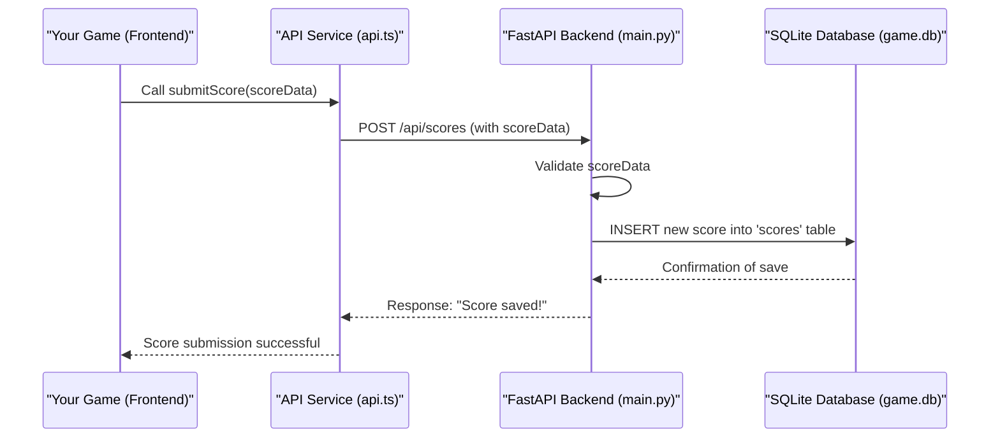

# Chapter 6: FastAPI Backend

Welcome back, adventurous developer! In our last chapter, [Chapter 5: Multiplayer System](05_multiplayer_system_.md), we explored how players can team up, either locally or across the internet. We saw how the game needs to synchronize everyone's actions to create a shared experience.

But how does this "across the internet" magic actually work? How does the game remember who has the highest score or manage all those online game rooms? That's where the **FastAPI Backend** comes into play – it's the game's central brain and communication hub, quietly working behind the scenes on a server somewhere on the internet.

## What is the FastAPI Backend?

Imagine the game `JumpJumpJump` running on many different computers around the world. Each game needs a reliable place to store important information and talk to other games. The **FastAPI Backend** is that place!

Built with **Python**, it's like a central office for `JumpJumpJump`:
*   **The Record-Keeper:** It stores important data like player high scores on a **global leaderboard** and keeps track of all the cool bosses you've defeated in the **boss gallery**. This data *persists*, meaning it remembers your progress even after you close the game.
*   **The Communication Hub:** It coordinates **online multiplayer rooms** using something called WebSockets. When you and a friend play online, your games don't talk directly to each other; they both talk to this backend, which then relays messages, ensuring everyone sees the same actions at the same time.

When your game needs to save or get information that should last forever or be shared with others, it sends a request to this backend. The backend then processes this data, often storing it in a small, efficient **SQLite database**.

### Why Do We Need It? (The Problem)

The main problem the `FastAPI Backend` solves is: **How do we create persistent, shared experiences for players across different game sessions and the internet?** Without a backend, your high scores would vanish when you close the game, and online multiplayer would be impossible!

### Your First Adventure: Topping the Leaderboard!

Let's trace a common scenario that uses the backend:

1.  You play an amazing game of `JumpJumpJump` and achieve a **new high score**!
2.  The game (running on your computer) sends your score to the **FastAPI Backend**.
3.  The backend **saves your score** in its database.
4.  You then click "Leaderboard" in the game menu.
5.  The game sends another request to the backend, asking for the **top scores**.
6.  The backend fetches the scores from its database and sends them back.
7.  The game displays the **updated global leaderboard** on your screen.

The FastAPI Backend handles every step of this, making sure your achievements are celebrated and shared!

## Key Concepts of Your Game's Central Hub

Let's break down the main ideas behind this backend system:

1.  **Server:** This is just a powerful computer that's always running, ready to listen for requests from game clients (your computer playing `JumpJumpJump`).
2.  **API (Application Programming Interface):** Think of this as a "menu" of services the backend offers. Your game asks for specific things from this menu (e.g., "Submit my score," "Give me the boss list"). These requests usually use **HTTP** (the same system your web browser uses to load websites).
    *   **GET Requests:** Used to *get* data (like asking for the leaderboard).
    *   **POST Requests:** Used to *send* data to create or update something (like submitting your score).
3.  **WebSockets:** This is a special, *real-time* communication channel. Unlike HTTP requests (which are like ordering food once), WebSockets keep an open, two-way connection (like a phone call). This is vital for fast, continuous updates needed for online multiplayer, where player movements need to be instantly shared.
4.  **Database (SQLite):** This is where the backend stores all its important information permanently. SQLite is a "lightweight" database, meaning it's easy to set up and works like a simple file, perfect for `JumpJumpJump`.
5.  **FastAPI:** This is the specific tool (a Python "framework") we use to build our API and WebSocket endpoints. It's chosen because it's very fast, easy to use, and automatically creates documentation for our API!

## How to Get Your Game Talking to the Backend (A Hands-On Look)

Let's see how `JumpJumpJump` (the frontend) talks to the `FastAPI Backend` to submit and retrieve scores.

### Step 1: Submitting a High Score

After a great game, your `GameScene` will gather your score data and ask the `GameAPI` service to send it to the backend.

```typescript
// Inside frontend/src/scenes/GameScene.ts (simplified excerpt)
import { GameAPI, ScoreData } from '../services/api' // Import GameAPI service

export default class GameScene extends Phaser.Scene {
  private playerName: string = 'NewPlayer' // Example player name
  private currentScore: number = 0
  // ... other game state ...

  // Call this when the game ends and you want to submit a score
  private async submitPlayerScore(): Promise<void> {
    const scoreData: ScoreData = {
      player_name: this.playerName,
      score: this.currentScore,
      coins: 50, // Example data
      enemies_defeated: 10,
      distance: 1200,
      level: 3,
      game_mode: 'endless'
    }

    try {
      // Send the score to the backend!
      const response = await GameAPI.submitScore(scoreData)
      console.log('🎉 Score submitted successfully:', response)
      // Maybe navigate to LeaderboardScene now
      this.scene.start('LeaderboardScene', { newScore: response })
    } catch (error) {
      console.error('Failed to submit score:', error)
      // Show an error message to the player
    }
  }
}
```
*What happens:* When your game ends, this `submitPlayerScore()` function is called. It creates a `scoreData` object with all your game stats. Then, `GameAPI.submitScore(scoreData)` sends this information to the `FastAPI Backend`. If successful, the `response` will confirm that your score was saved.

### Step 2: Retrieving the Leaderboard

To show the global high scores, your `LeaderboardScene` will ask the `GameAPI` service to fetch them from the backend.

```typescript
// Inside frontend/src/scenes/LeaderboardScene.ts (simplified excerpt)
import { GameAPI, ScoreResponse } from '../services/api' // Import GameAPI service

export default class LeaderboardScene extends Phaser.Scene {
  private leaderboardScores: ScoreResponse[] = []
  // ... other scene elements ...

  create() {
    this.add.text(640, 50, 'GLOBAL LEADERBOARD', { fontSize: '48px' }).setOrigin(0.5)
    this.fetchLeaderboard() // Call this to load scores when the scene starts
  }

  private async fetchLeaderboard(): Promise<void> {
    try {
      // Request the top 10 scores from the backend
      this.leaderboardScores = await GameAPI.getLeaderboard(10, 'endless')
      console.log('🏆 Leaderboard loaded:', this.leaderboardScores)
      this.displayScores() // Now display them on screen
    } catch (error) {
      console.error('Failed to fetch leaderboard:', error)
      // Display an error or fallback message
    }
  }

  private displayScores(): void {
    let yPos = 120
    this.leaderboardScores.forEach((scoreEntry, index) => {
      this.add.text(
        640, yPos + index * 40,
        `${scoreEntry.rank}. ${scoreEntry.player_name}: ${scoreEntry.score}`,
        { fontSize: '24px' }
      ).setOrigin(0.5)
    })
  }
}
```
*What happens:* When the `LeaderboardScene` starts, `fetchLeaderboard()` is called. `GameAPI.getLeaderboard(10, 'endless')` sends a request to the backend asking for the top 10 scores specifically for "endless" game mode. The backend responds with a list of scores, which are then displayed on the screen.

## Inside the FastAPI Backend (How It Works)

Let's peek behind the curtain and see how the FastAPI Backend handles these requests. The main code for this is in `backend/main.py`.

### The Journey of a High Score (Non-Code Walkthrough)

When you submit a high score:

1.  **Game Ends & Data Sent:** Your game (frontend) finishes, and `submitScore` (from `frontend/src/services/api.ts`) sends a `POST` request with your `scoreData` to the `FastAPI Backend`.
2.  **Backend Receives:** The FastAPI application (running `main.py` on a server) receives this `POST` request at its `/api/scores` address.
3.  **Data Validation:** FastAPI uses a helper (`Pydantic` model) to quickly check if the incoming `scoreData` is valid (e.g., `score` is a number, `player_name` is text).
4.  **Database Action:** The backend takes the validated data and tells the `SQLite` database to `INSERT` a new row into its `scores` table.
5.  **Database Confirms:** SQLite saves the score and confirms it's done.
6.  **Backend Responds:** FastAPI then sends a confirmation message back to your game (frontend), letting it know the score was saved.

Here's a simple diagram to illustrate this flow:



### Simplified Code Snippets (Under the Hood)

Let's look at simplified parts of the `backend/main.py` file.

**1. Initializing the Database (`init_db()`):**
This function runs once when the backend starts, making sure the `scores` table exists in `game.db`.

```python
# Inside backend/main.py
def init_db():
    conn = sqlite3.connect(DB_PATH) # Connect to the database file
    cursor = conn.cursor()
    cursor.execute("""
        CREATE TABLE IF NOT EXISTS scores (
            id INTEGER PRIMARY KEY AUTOINCREMENT,
            player_name TEXT NOT NULL,
            score INTEGER NOT NULL,
            game_mode TEXT NOT NULL,
            created_at TIMESTAMP DEFAULT CURRENT_TIMESTAMP
        )
    """)
    conn.commit() # Save changes
    conn.close()
```
*Explanation:* This Python code uses the `sqlite3` library to connect to our `game.db` file. If the `scores` table doesn't already exist, it creates it with columns for `player_name`, `score`, `game_mode`, and a timestamp. `PRIMARY KEY AUTOINCREMENT` means `id` will automatically increase for each new score.

**2. Submitting a Score (`submit_score` endpoint):**
This is the function that runs when the backend receives a `POST` request to `/api/scores`.

```python
# Inside backend/main.py (simplified submit_score)
@app.post("/api/scores", response_model=ScoreResponse)
def submit_score(score_data: ScoreSubmit):
    conn = sqlite3.connect(DB_PATH)
    cursor = conn.cursor()
    cursor.execute("""
        INSERT INTO scores (player_name, score, game_mode)
        VALUES (?, ?, ?)
    """, (
        score_data.player_name,
        score_data.score,
        score_data.game_mode
    ))
    score_id = cursor.lastrowid # Get the ID of the new score
    conn.commit()
    # ... retrieve and return the full score entry (omitted for brevity) ...
    conn.close()
    return ScoreResponse(id=score_id, **score_data.dict(), created_at=datetime.now().isoformat())
```
*Explanation:* This FastAPI `endpoint` receives `score_data`. It connects to the database, then executes an `INSERT` SQL command to add the `player_name`, `score`, and `game_mode` into the `scores` table. `conn.commit()` saves these changes, and then `score_id` is used to create a response that confirms the score was saved.

**3. Retrieving the Leaderboard (`get_leaderboard` endpoint):**
This function handles `GET` requests to `/api/scores/leaderboard`.

```python
# Inside backend/main.py (simplified get_leaderboard)
@app.get("/api/scores/leaderboard", response_model=List[ScoreResponse])
def get_leaderboard(limit: int = 10, game_mode: Optional[str] = None):
    conn = sqlite3.connect(DB_PATH)
    cursor = conn.cursor()
    query = """
        SELECT id, player_name, score, game_mode, created_at
        FROM scores
        WHERE game_mode = ? OR ? IS NULL
        ORDER BY score DESC
        LIMIT ?
    """
    cursor.execute(query, (game_mode, game_mode, limit))
    rows = cursor.fetchall() # Get all matching rows
    conn.close()
    
    results = []
    for idx, row in enumerate(rows):
        results.append(ScoreResponse(id=row[0], player_name=row[1], score=row[2], 
                                     game_mode=row[3], created_at=row[4], rank=idx+1))
    return results
```
*Explanation:* This `endpoint` takes optional `limit` and `game_mode` parameters. It constructs a `SELECT` SQL query to fetch scores, ordering them from highest `score` downwards. `cursor.fetchall()` retrieves all the results, which are then formatted into a list of `ScoreResponse` objects and sent back to the frontend.

### Real-Time Communication with WebSockets

For multiplayer, the backend uses WebSockets. Instead of a single request-response, a persistent connection is maintained.

```python
# Inside backend/main.py (simplified websocket_room_endpoint for player_state)
from rooms import room_manager, GameRoom # Import room management

@app.websocket("/ws/room/{room_id}")
async def websocket_room_endpoint(websocket: WebSocket, room_id: str):
    await websocket.accept() # Establish the WebSocket connection
    player_id = None
    current_room: Optional[GameRoom] = None
    try:
        while True:
            data = await websocket.receive_json() # Listen for messages
            message_type = data.get("type")

            if message_type == "create_room":
                player_id = data.get("player_id") or secrets.token_hex(8)
                current_room = await room_manager.create_room(
                    room_id=room_id, host_id=player_id, websocket=websocket
                )
                await websocket.send_json({"type": "room_created", "room_id": room_id, "player_id": player_id})

            elif message_type == "player_state":
                if current_room and player_id:
                    state_update = data.get("state", {})
                    current_room.update_player_state(player_id, state_update)
                    # Send this player's state to ALL OTHER players in the room
                    await current_room.broadcast({
                        "type": "player_state_update",
                        "player_id": player_id,
                        "state": state_update
                    }, exclude=player_id)
            # ... other message types like 'game_action', 'collect_item', 'enemy_state' ...
    except WebSocketDisconnect:
        if current_room and player_id:
            await current_room.remove_player(player_id) # Clean up on disconnect
```
*Explanation:* The `websocket_room_endpoint` is where all real-time multiplayer communication happens.
1.  **`websocket.accept()`:** When a player connects, the backend "accepts" their WebSocket, opening a continuous channel.
2.  **`websocket.receive_json()`:** The backend then enters a loop, constantly listening for JSON messages (like `create_room` or `player_state`) from that player's game.
3.  **`create_room`:** If a player wants to make a new room, the `room_manager` creates a `GameRoom` object (which tracks all players in that room).
4.  **`player_state`:** If a player sends a `player_state` message (e.g., they moved or jumped), the backend updates its record of that player's state. Crucially, `current_room.broadcast()` then sends that same message to *all other players* in the room, making sure everyone's game stays synchronized.
5.  **`WebSocketDisconnect`:** If a player closes their game, the `remove_player` logic runs to clean up their connection.

## Backend's Roles: API vs. WebSockets

The FastAPI Backend plays two distinct, but equally important, roles:

| Feature / Role    | API Endpoints (HTTP)                                   | WebSocket Endpoints                                     |
| :---------------- | :----------------------------------------------------- | :------------------------------------------------------ |
| **Purpose**       | Request/send data that isn't real-time, one-time actions | Real-time, continuous communication for dynamic events  |
| **Example Use**   | Submit high scores, fetch leaderboard, get boss info     | Online multiplayer (player movement, enemy sync, chat)  |
| **Communication** | Request-response model (like ordering food)            | Persistent, two-way connection (like a phone call)      |
| **Protocol**      | HTTP/HTTPS                                             | WebSocket Secure (wss://)                               |
| **Latency**       | Tolerant of small delays                               | Critical for low latency (smooth multiplayer)           |
| **Key Methods**   | `GET`, `POST`, `PUT`, `DELETE`                         | `send()`, `receive()`, `broadcast()`                    |
| **Frontend Side** | `GameAPI` (using `fetch` or `axios`)                   | `OnlineCoopService` (using `WebSocket` API)             |

This separation allows the backend to efficiently handle both static data storage and dynamic, real-time multiplayer interactions.

### WebSocket Security Best Practices

When deploying the backend to production, it's crucial to ensure secure WebSocket connections:

**Production Requirements:**
- Always use **WebSocket Secure (wss://)** protocol in production environments
<!-- nosemgrep: javascript.lang.security.detect-insecure-websocket.detect-insecure-websocket -->
- Never use insecure `ws://` protocol for production deployments (this is a security warning, not actual insecure code)
- The `wss://` protocol encrypts all data transmitted between client and server, preventing eavesdropping and man-in-the-middle attacks

**Development vs Production:**
- **Development (localhost):** `ws://localhost:8000` is acceptable for local testing
- **Production:** Must use `wss://your-domain.com` with valid SSL/TLS certificates

**Implementation Notes:**
- Frontend WebSocket connections should automatically use `wss://` when the site is served over HTTPS
- Backend servers should be configured behind a reverse proxy (like nginx or Railway's built-in proxy) that handles SSL/TLS termination
- Ensure your CSP (Content Security Policy) includes the appropriate `connect-src` directive for WebSocket connections

## Conclusion

You've successfully explored the "FastAPI Backend," the powerful, silent partner that keeps `JumpJumpJump` connected, persistent, and social! You've learned how it uses HTTP APIs for data like high scores and WebSockets for real-time multiplayer coordination, all powered by Python and a lightweight SQLite database. This backend is the anchor that holds the entire online game experience together.

Now that the game has a solid foundation for both single-player and multiplayer, what if we wanted to teach a computer to play `JumpJumpJump` just like a human (or even better)? That's where the "DQN AI Agent" comes in.

[Next Chapter: DQN AI Agent](07_dqn_ai_agent.md)

---

<sub><sup>Generated by [AI Codebase Knowledge Builder](https://github.com/The-Pocket/Tutorial-Codebase-Knowledge).</sup></sub> <sub><sup>**References**: [[1]](https://github.com/aidenphangruiyin-cmyk/JumpJumpJump/blob/53ec676b48281d02cbc5a9f471a1a2545c901f91/Claude.md), [[2]](https://github.com/aidenphangruiyin-cmyk/JumpJumpJump/blob/53ec676b48281d02cbc5a9f471a1a2545c901f91/TECHNICAL_GUIDE.md), [[3]](https://github.com/aidenphangruiyin-cmyk/JumpJumpJump/blob/53ec676b48281d02cbc5a9f471a1a2545c901f91/backend/Dockerfile), [[4]](https://github.com/aidenphangruiyin-cmyk/JumpJumpJump/blob/53ec676b48281d02cbc5a9f471a1a2545c901f91/backend/RAILWAY.md), [[5]](https://github.com/aidenphangruiyin-cmyk/JumpJumpJump/blob/53ec676b48281d02cbc5a9f471a1a2545c901f91/backend/README.md), [[6]](https://github.com/aidenphangruiyin-cmyk/JumpJumpJump/blob/53ec676b48281d02cbc5a9f471a1a2545c901f91/backend/main.py), [[7]](https://github.com/aidenphangruiyin-cmyk/JumpJumpJump/blob/53ec676b48281d02cbc5a9f471a1a2545c901f91/frontend/src/services/api.ts)</sup></sub>