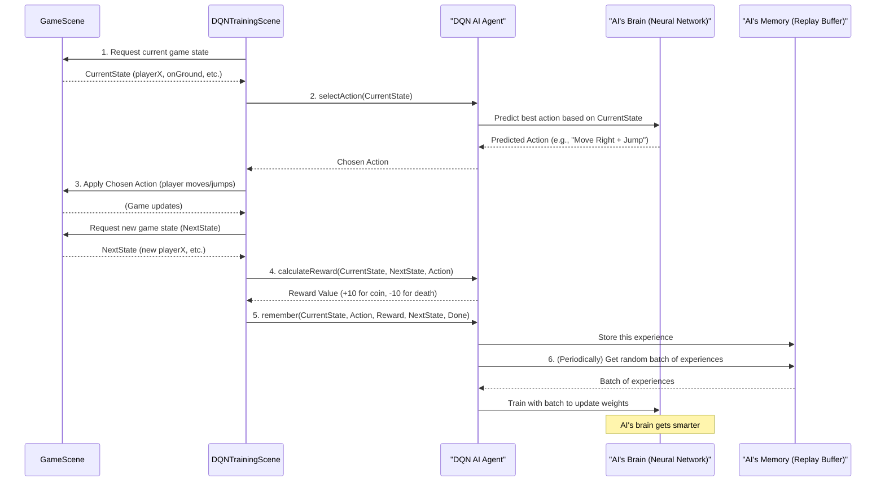

# Chapter 7: DQN AI Agent

Welcome back, game adventurer! We've come a long way. In [Chapter 6: FastAPI Backend](06_fastapi_backend_.md), we learned how the game handles high scores and multiplayer online using a powerful backend server. Now, imagine a player who never gets tired, learns from every mistake, and can eventually play `JumpJumpJump` like a pro, all by itself!

This isn't magic; it's the **DQN AI Agent** in action.

## What is the DQN AI Agent?

The **DQN AI Agent** (DQN stands for Deep Q-Network) is like an artificial brain that learns to play `JumpJumpJump` all by itself, through a process very similar to how a child learns a new skill.

Think of it this way:
*   A child tries to walk: it falls, gets back up, tries again.
*   With each attempt, its brain learns a little bit about what works and what doesn't.
*   Eventually, it walks, runs, and jumps with ease.

Our DQN AI Agent does the same! It's a special type of AI that observes the game, makes decisions, receives "good job!" (rewards) or "oops!" (penalties), and then slowly adjusts its "brain" (a special kind of computer program called a **neural network**) to make better choices next time. It learns from its own trials and errors, aiming to get the highest score possible.

### Why Do We Need It? (The Problem)

The main problem the `DQN AI Agent` solves is: **How can a computer learn to play our game autonomously, adapt to challenges, and even discover new strategies without being explicitly programmed for every single situation?** Instead of us writing rules like "IF enemy near AND player on ground THEN jump", the AI figures out these rules by itself.

### Your First Adventure: Watching an AI Learn!

Let's imagine how you might interact with the DQN AI Agent:

1.  You start the game and select **"AI Training"** from the main menu. This takes you to a special screen, the `DQNTrainingScene`.
2.  You press **SPACE** to start the training.
3.  The game starts, but **the AI is controlling the player!**
4.  At first, the AI is terrible. It runs into enemies, falls into gaps, and dies quickly.
5.  But each time it dies, it gets a penalty, and its "brain" slightly changes. Each time it moves forward or collects a coin, it gets a reward.
6.  Over many "episodes" (rounds of play), you'll notice the AI getting better and better. It learns to jump over gaps, avoid spikes, and even shoot enemies!
7.  Eventually, it masters the game, showing you strategies you might not have even thought of!

The DQN AI Agent handles all the learning and decision-making, turning a simple platformer into a fascinating AI experiment.

## Key Concepts of Your Learning AI

Let's break down the main ideas behind this AI system:

1.  **Trial and Error Learning (Reinforcement Learning):** This is the core idea. The AI isn't programmed with instructions; it learns by trying things out, seeing the results, and adjusting its behavior based on rewards or penalties.
2.  **State (Observation):** What the AI "sees" about the game world. This is crucial input for its decision-making. In `JumpJumpJump`, the AI observes things like:
    *   **Player's position and speed:** Where is it? How fast is it moving?
    *   **Whether it's on the ground:** Can it jump?
    *   **Distance to nearest platform:** How far is the next jump?
    *   **Distance to nearest enemy/spike:** Are there dangers nearby?
    *   **If there's ground ahead/gap ahead:** What's coming next?
3.  **Actions:** What the AI can "do" in the game. These are the equivalent of your key presses:
    *   Do Nothing (Idle)
    *   Move Left / Move Right
    *   Jump
    *   Shoot
    *   Combinations like "Move Right + Jump" or "Move Right + Jump + Shoot"
4.  **Rewards and Penalties:** How the AI knows if its actions were good or bad.
    *   **Rewards (+):** Moving forward, collecting coins, defeating enemies, staying alive.
    *   **Penalties (-):** Dying, standing still for too long (getting stuck).
5.  **Neural Network ("Brain"):** This is the core of the AI. It's a complex mathematical model (like a simplified version of a human brain) that takes the "State" as input and tries to predict the best "Action" to maximize future rewards.
6.  **Training:** The continuous process of the AI playing, receiving rewards, and updating its neural network. The more it trains, the smarter it gets.
7.  **Epsilon-Greedy Exploration:** During training, the AI needs to balance two things:
    *   **Exploration:** Trying new, random actions to discover better ways to play.
    *   **Exploitation:** Using the actions it *already knows* are good.
    *   `Epsilon` is a number that controls this balance. At first, `epsilon` is high (lots of exploration). As the AI learns, `epsilon` decreases, and it starts to `exploit` its knowledge more.
8.  **Experience Replay Buffer:** The AI remembers its past experiences (what `state` it was in, what `action` it took, what `reward` it got, and what the `next state` was). It stores these in a "buffer" and later samples random memories to learn from, which makes training more stable and efficient.

## How to Get Your AI Learning (A Hands-On Look)

The DQN AI Agent is primarily managed within the `DQNTrainingScene`, which interacts with the main `GameScene` to play the game.

### Step 1: Navigating to the AI Training Scene

First, you need to add a button to your `MenuScene` to jump into the `DQNTrainingScene`. (This setup is already done for you in `JumpJumpJump`, as per the `DQN_README.md`).

```typescript
// Inside frontend/src/scenes/MenuScene.ts (simplified excerpt)
// ...
create() {
  // ... other menu buttons ...

  // Create "AI Training" button
  const aiTrainingButton = this.add.text(640, 600, '🤖 AI Training', {
    fontSize: '32px', color: '#00ff00'
  })
  .setOrigin(0.5) // Center the text
  .setInteractive({ useHandCursor: true })

  aiTrainingButton.on('pointerdown', () => {
    // Start the DQNTrainingScene
    this.scene.start('DQNTrainingScene')
    console.log('🚀 MenuScene: Starting DQNTrainingScene...')
  })
}
// ...
```
*What happens:* When you click this button, the `MenuScene` is stopped, and the dedicated `DQNTrainingScene` is launched.

### Step 2: Starting the Training Process

Inside the `DQNTrainingScene` (see `frontend/src/scenes/DQNTrainingScene.ts`), you interact with the UI to control the training. The most important key is **SPACE** to start.

```typescript
// Inside frontend/src/scenes/DQNTrainingScene.ts (simplified excerpt)
import Phaser from 'phaser'
import GameScene from './GameScene' // The actual game where AI plays
import { DQNAgent } from '../utils/DQNAgent' // Our AI brain

export default class DQNTrainingScene extends Phaser.Scene {
  private gameScene!: GameScene // Reference to the game being played
  private dqnAgent!: DQNAgent // Our AI agent
  private isTraining = false // Flag to control training

  // ... constructor, UI setup ...

  create() {
    // ... UI setup, keyboard controls ...
    this.setupControls() // Sets up key listeners like SPACE

    this.startGameScene() // Launches a GameScene in AI mode

    this.time.delayedCall(500, () => {
      // Create our AI agent, passing the GameScene
      this.dqnAgent = new DQNAgent(this.gameScene)
      this.dqnAgent.loadModel().then(loaded => {
        this.showNotification(loaded ? 'Model loaded! 🎉' : 'Fresh model. Press SPACE!')
      })
    })
    // ...
  }

  private setupControls() {
    const kb = this.input.keyboard
    if (!kb) return

    kb.on('keydown-SPACE', () => {
      // Toggle training on/off when SPACE is pressed
      this.isTraining ? this.pauseTraining() : this.startTraining()
    })
    // ... other controls like R (reset), S (save), L (load) ...
  }

  private startTraining() {
    if (!this.dqnAgent) return // Make sure the AI is ready
    this.isTraining = true // Start the training loop
    this.episode++ // Increment episode counter
    this.currentStep = 0 // Reset step counter for this episode
    this.dqnAgent.resetEpisode() // Reset AI's internal episode stats
    this.showNotification('🟢 Training started!')
  }

  private pauseTraining() {
    this.isTraining = false // Pause the training loop
    this.showNotification('🟡 Training paused.')
  }

  update() {
    // This is the main training loop, running many times per second
    if (!this.isTraining || !this.gameScene) return

    // Run multiple training steps per update for faster training (trainingSpeed)
    for (let i = 0; i < this.trainingSpeed; i++) {
      this.trainingStep()
    }
    // ... update UI ...
  }
}
```
*What happens:* The `DQNTrainingScene` first creates an instance of our `DQNAgent`. When you press `SPACE`, `startTraining()` sets `isTraining` to `true`. Now, in every `update` call of the `DQNTrainingScene`, the `trainingStep()` function is called, which orchestrates the AI playing and learning.

## Inside the DQN AI Agent (How It Works)

Let's trace a single "thought process" of the AI agent within the `trainingStep()` loop. The main logic is in `frontend/src/utils/DQNAgent.ts` and `frontend/src/scenes/DQNTrainingScene.ts`.

### The Journey of an AI Decision (Non-Code Walkthrough)

Here's a simplified step-by-step look at what happens in one `trainingStep()`:

1.  **Capture Game State:** The `DQNTrainingScene` asks the `GameScene` for all the important information about the game right now (player's position, speed, nearest enemy, etc.). This becomes the `currentState`.
2.  **AI Selects Action:** The `DQNAgent` receives this `currentState`.
    *   With a small `epsilon` chance, it picks a **random action** (Exploration).
    *   Most of the time (1 - `epsilon` chance), it feeds the `currentState` into its **neural network** and gets a prediction for the *best* action to take (Exploitation).
    *   It returns the chosen `action` (e.g., "Move Right + Jump").
3.  **Execute Action:** The `DQNTrainingScene` tells the `GameScene` to perform the AI's chosen `action` (e.g., making the player character actually move right and jump).
4.  **Receive Feedback (Reward):** The `DQNAgent` looks at the `currentState`, the `action` it took, and the `nextState` (the game after the action). It calculates a `reward` or `penalty` based on whether the action led to progress, points, or death.
5.  **Remember Experience:** The `DQNAgent` stores this whole "experience" (old state, action taken, reward, new state, whether the game ended) in its `replayBuffer`.
6.  **Train Neural Network:** The `DQNAgent` periodically takes a random batch of these stored experiences from its `replayBuffer` and uses them to train its neural network, making its "brain" slightly smarter.
7.  **Repeat:** This cycle repeats thousands of times per second, leading to learning!

Here's a simple diagram to illustrate this flow:



### Simplified Code Snippets (Under the Hood)

Let's peek at some simplified parts of the `DQNAgent.ts` and `DQNTrainingScene.ts` files.

**1. Capturing the Game State (`captureGameState()` in `DQNTrainingScene.ts`):**
This function gathers all the necessary information from the `GameScene` to form the AI's "observation" (its `DQNState`).

```typescript
// Inside frontend/src/scenes/DQNTrainingScene.ts (simplified captureGameState())
private captureGameState(): DQNState | null {
  const player = (this.gameScene as any).player
  if (!player?.body) return null // If player doesn't exist yet

  const body = player.body as Phaser.Physics.Arcade.Body
  // Get other game objects
  const platforms = (this.gameScene as any).platforms
  const enemies = (this.gameScene as any).enemies
  const spikes = (this.gameScene as any).spikes

  // Calculate distances to nearest obstacles
  let nearestPlatformDistance = 1000; let nearestPlatformHeight = 0
  // ... loop through platforms to find nearest ...
  // ... loop through enemies to find nearest ...
  // ... loop through spikes to find nearest ...

  const hasGroundAhead = this.checkGroundAhead(platforms, player.x + 100, player.y)
  const gapAhead = !this.checkGroundAhead(platforms, player.x + 150, player.y)

  return { // This is the DQNState object!
    playerX: player.x, playerY: player.y,
    velocityX: body.velocity.x, velocityY: body.velocity.y,
    onGround: body.touching.down,
    nearestPlatformDistance, nearestPlatformHeight,
    nearestEnemyDistance: 1000, nearestSpikeDistance: 1000, // Simplified distances
    hasGroundAhead, gapAhead,
    bossActive: false, bossDistance: 1000, bossHealth: 100
  }
}
```
*Explanation:* This code queries the `GameScene` for various pieces of information about the player and the environment. It calculates distances to nearby platforms, enemies, and spikes. It then packages all this into a `DQNState` object, which is essentially a snapshot of the game that the AI can understand.

**2. Selecting an Action (`selectAction()` in `DQNAgent.ts`):**
This is where the AI decides what to do next.

```typescript
// Inside frontend/src/utils/DQNAgent.ts (simplified selectAction())
public async selectAction(state: DQNState): Promise<DQNAction> {
  // Epsilon-greedy: sometimes explore randomly, sometimes use the brain
  if (Math.random() < this.epsilon) {
    // Explore: pick a random action
    return this.actionIndexToAction(Math.floor(Math.random() * this.actionSize))
  }

  // Exploit: ask the neural network (the "brain")
  const stateArray = this.stateToArray(state) // Convert state object to numbers
  const stateTensor = tf.tensor2d([stateArray]) // Prepare for neural network
  const qValues = this.policyNet.predict(stateTensor) as tf.Tensor // Ask the brain!
  const qValuesData = await qValues.data() // Get the brain's "scores" for each action

  stateTensor.dispose(); qValues.dispose() // Clean up memory

  // Pick the action with the highest "score" from the brain
  const bestActionIndex = Array.from(qValuesData).indexOf(Math.max(...qValuesData))
  return this.actionIndexToAction(bestActionIndex) // Convert number back to game action
}
```
*Explanation:* This function implements the epsilon-greedy strategy. It first checks if it should explore (take a random action) or exploit (use its learned knowledge). To exploit, it converts the `DQNState` into a list of numbers (`stateArray`) that the `policyNet` (its neural network) can understand. The network then `predicts` a "Q-value" for each possible action, indicating how good it thinks each action is. The AI then chooses the action with the highest predicted Q-value.

**3. Applying the Action (`applyAction()` in `DQNTrainingScene.ts`):**
Once the AI decides on an action, the training scene tells the `GameScene` to perform it.

```typescript
// Inside frontend/src/scenes/DQNTrainingScene.ts (simplified applyAction())
private applyAction(action: any) {
  // 'gameScene' has a method 'setAIAction' to control the player
  if ((this.gameScene as any).setAIAction) {
    (this.gameScene as any).setAIAction(action)
  }
}
```
*Explanation:* This simple function takes the `DQNAction` (which specifies `moveLeft`, `moveRight`, `jump`, `shoot`) and calls a method in the `GameScene` to actually make the player character move and react as the AI commanded.

**4. Calculating the Reward (`calculateReward()` in `DQNAgent.ts`):**
This function determines how well the AI performed after an action.

```typescript
// Inside frontend/src/utils/DQNAgent.ts (simplified calculateReward())
public calculateReward(state: DQNState, isDead: boolean, score: number, currentAction: number): number {
  let reward = 0
  if (isDead) { // Big penalty for dying
    return -10
  }

  const progress = state.playerX - this.lastX // How much player moved right
  if (progress > 0) {
    reward += progress / 50 // Reward for moving forward
    this.framesSinceProgress = 0 // Reset stuck counter
  } else {
    this.framesSinceProgress++
    // Penalties for being stuck (not moving forward)
    if (this.framesSinceProgress > 90) reward -= 2.0 // Very strong penalty
    else if (this.framesSinceProgress > 60) reward -= 1.0 // Strong penalty
    // ... more progressive penalties ...
  }
  
  // Reward for increasing score (e.g., collecting coins)
  reward += (score - this.lastScore) / 10
  
  // Small positive reward for just being alive each frame
  reward += 0.01

  // Reward for being on ground
  if (state.onGround) reward += 0.05
  
  // Boss engagement rewards (if a boss is active)
  if (state.bossActive) {
      if (state.bossDistance < 400) reward += 0.5 // Reward for being close to boss
      if (currentAction === 6 && state.bossDistance < 500) reward += 0.8 // Reward for shooting at boss
      if (progress > 50 && state.bossDistance > 500) reward -= 2.0 // Penalty for rushing past boss
  }

  this.lastX = state.playerX // Remember player's position for next frame's progress calculation
  this.lastScore = score    // Remember score for next frame's score calculation
  return reward
}
```
*Explanation:* This is the core of "teaching" the AI. It takes the game's situation and returns a number: positive for good actions, negative for bad ones. It rewards the AI for moving forward, getting points, and staying alive. It penalizes getting stuck or dying. There are also special rewards/penalties for boss encounters.

**5. Remembering Experiences and Training (`remember()` and `train()` in `DQNAgent.ts`):**
These functions handle storing past actions and then using them to learn.

```typescript
// Inside frontend/src/utils/DQNAgent.ts (simplified remember())
public remember(state: DQNState, action: number, reward: number, nextState: DQNState, done: boolean): void {
  // Store the experience tuple in the replay buffer
  this.replayBuffer.push({
    state: this.stateToArray(state), // Convert state to array of numbers
    action, reward,
    nextState: this.stateToArray(nextState),
    done // True if episode ended (e.g., player died)
  })
  if (this.replayBuffer.length > this.maxBufferSize) {
    this.replayBuffer.shift() // Keep buffer size within limits
  }
  this.totalReward += reward // Keep track of total reward for current episode
}

// Inside frontend/src/utils/DQNAgent.ts (simplified train())
public async train(): Promise<number | null> {
  // Only start training if enough experiences are in the buffer
  if (this.replayBuffer.length < this.minBufferSize) return null

  this.trainingSteps++
  // Periodically update the "target network" for stable learning
  if (this.trainingSteps % this.targetUpdateFrequency === 0) {
    this.targetNet.setWeights(this.policyNet.getWeights())
  }

  // Slowly decrease epsilon to reduce random exploration over time
  if (this.epsilon > this.epsilonMin) {
    this.epsilon *= this.epsilonDecay
  }

  // (Actual training involves sampling a batch, calculating loss, and updating policyNet weights)
  // For simplicity, we just return a dummy value here.
  // tf.tensor2d(batchStates), tf.tensor2d(batchTargets) is used with policyNet.fit
  return 0.5 // Dummy loss value
}
```
*Explanation:* The `remember()` function takes the complete experience of one game step and adds it to the `replayBuffer`. The `train()` function, called frequently, first ensures there's enough data in the buffer. It then periodically copies the "brain" (`policyNet`) to a "target brain" (`targetNet`) for more stable learning. It also slowly reduces `epsilon`, meaning the AI will become less random over time. The actual deep learning math happens within `policyNet.fit` using TensorFlow.js, which is too complex for this beginner chapter but is where the neural network's weights (connections) are adjusted to improve decision-making.

## AI's Senses and Actions: A Closer Look

Here's a detailed view of what the AI can `observe` and `do`:

| State Feature (AI's Observation) | Description                                                     |
| :------------------------------- | :-------------------------------------------------------------- |
| `playerX`, `playerY`             | Player's current horizontal and vertical position.              |
| `velocityX`, `velocityY`         | Player's horizontal and vertical speed.                         |
| `onGround`                       | True if player is currently touching a platform.                |
| `nearestPlatformDistance`        | Distance to the closest platform.                               |
| `nearestPlatformHeight`          | Height difference to the nearest platform (negative if above).  |
| `nearestEnemyDistance`           | Distance to the closest enemy.                                  |
| `nearestSpikeDistance`           | Distance to the closest spike trap.                             |
| `hasGroundAhead`                 | True if there's solid ground directly in front of the player.   |
| `gapAhead`                       | True if there's a gap a short distance in front of the player.  |
| `bossActive`                     | True if a boss is currently on screen.                          |
| `bossDistance`                   | Distance to the boss if active.                                 |
| `bossHealth`                     | Remaining health of the boss (0-100%).                          |

| Action (AI's Movement)                    | Description                                         |
| :---------------------------------------- | :-------------------------------------------------- |
| `0: Idle`                                 | Do nothing (stand still).                           |
| `1: Move Left`                            | Move the player character to the left.              |
| `2: Move Right`                           | Move the player character to the right.             |
| `3: Jump`                                 | Make the player jump upwards.                       |
| `4: Move Right + Jump`                    | Move right and jump simultaneously.                 |
| `5: Shoot Only`                           | Fire the weapon without moving.                     |
| `6: Move Right + Shoot`                   | Move right and shoot simultaneously.                |
| `7: Move Left + Shoot`                    | Move left and shoot simultaneously.                 |
| `8: Move Right + Jump + Shoot`            | Move right, jump, and shoot simultaneously.         |

This comprehensive set of observations and actions allows the AI to learn complex strategies needed to master `JumpJumpJump`!

## Conclusion

You've now explored the fascinating world of the "DQN AI Agent"! You've learned how this artificial intelligence "player" learns to master `JumpJumpJump` through trial and error, observing the game state, taking actions, receiving rewards, and constantly refining its neural network "brain." This system is a powerful demonstration of how machine learning can create intelligent, autonomous agents within a game.

This chapter concludes our journey through the core abstractions of `JumpJumpJump`. From player controls to infinite worlds, and from multiplayer to AI, you've gained a fundamental understanding of how such a complex web-based game is built!

---

<sub><sup>Generated by [AI Codebase Knowledge Builder](https://github.com/The-Pocket/Tutorial-Codebase-Knowledge).</sup></sub> <sub><sup>**References**: [[1]](https://github.com/aidenphangruiyin-cmyk/JumpJumpJump/blob/53ec676b48281d02cbc5a9f471a1a2545c901f91/DQN_README.md), [[2]](https://github.com/aidenphangruiyin-cmyk/JumpJumpJump/blob/53ec676b48281d02cbc5a9f471a1a2545c901f91/PRPs/ML-AI-Implementation.md), [[3]](https://github.com/aidenphangruiyin-cmyk/JumpJumpJump/blob/53ec676b48281d02cbc5a9f471a1a2545c901f91/PRPs/ML-AI-Implementation_cn.md), [[4]](https://github.com/aidenphangruiyin-cmyk/JumpJumpJump/blob/53ec676b48281d02cbc5a9f471a1a2545c901f91/TECHNICAL_GUIDE.md), [[5]](https://github.com/aidenphangruiyin-cmyk/JumpJumpJump/blob/53ec676b48281d02cbc5a9f471a1a2545c901f91/frontend/src/scenes/DQNTrainingScene.ts), [[6]](https://github.com/aidenphangruiyin-cmyk/JumpJumpJump/blob/53ec676b48281d02cbc5a9f471a1a2545c901f91/frontend/src/types/GameTypes.ts), [[7]](https://github.com/aidenphangruiyin-cmyk/JumpJumpJump/blob/53ec676b48281d02cbc5a9f471a1a2545c901f91/frontend/src/utils/DQNAgent.ts), [[8]](https://github.com/aidenphangruiyin-cmyk/JumpJumpJump/blob/53ec676b48281d02cbc5a9f471a1a2545c901f91/frontend/src/utils/GameplayRecorder.ts), [[9]](https://github.com/aidenphangruiyin-cmyk/JumpJumpJump/blob/53ec676b48281d02cbc5a9f471a1a2545c901f91/frontend/src/utils/MLAIPlayer.ts)</sup></sub>