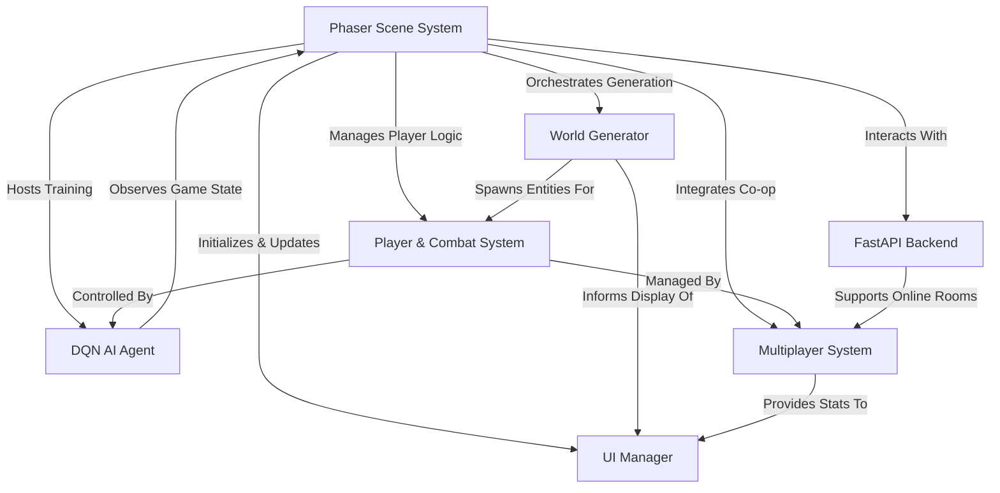

# Tutorial: JumpJumpJump

JumpJumpJump is an *exciting web-based platformer game* where players **jump and shoot through endless, procedurally generated levels**. It features **challenging boss fights**, *online leaderboards* for global competition, and even a **DQN AI agent that learns to play** the game on its own. Players can also enjoy **local and online co-op** modes, all built with React, Phaser, and a FastAPI backend.

## Visual Overview

## Chapters

1. [Player & Combat System
](01_player___combat_system_.md)
2. [Phaser Scene System
](02_phaser_scene_system_.md)
3. [World Generator
](03_world_generator_.md)
4. [UI Manager
](04_ui_manager_.md)
5. [Multiplayer System
](05_multiplayer_system_.md)
6. [FastAPI Backend
](06_fastapi_backend_.md)
7. [DQN AI Agent
](07_dqn_ai_agent_.md)